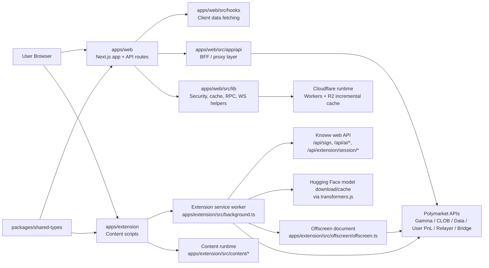
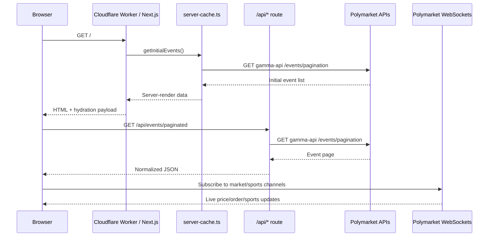
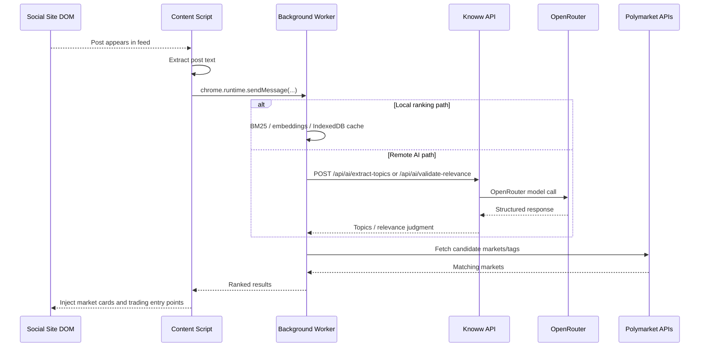
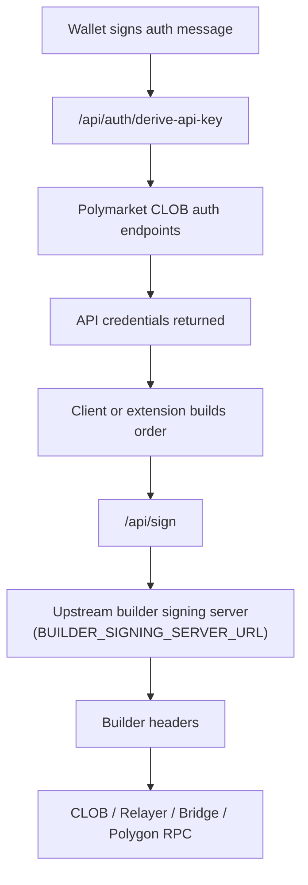

# Knoww Architecture

This document explains how the `polycaster` repository is put together for a new engineer joining the team.

## 1. System Overview

### What this project does

Knoww is a prediction-markets product built on top of Polymarket.

It has two user-facing surfaces:

- `apps/web`: the public web app at `knoww.app`, where users browse markets, view portfolios, inspect whale activity, and place trades.
- `apps/extension`: a Chrome extension that injects relevant prediction-market cards into social feeds and can initiate trading flows from those pages.

### Who uses it

- End users browsing prediction markets on the web app
- Traders connecting Polygon wallets and placing Polymarket orders
- Extension users reading X/Twitter, LinkedIn, Reddit, and Farcaster feeds and discovering related markets inline

### Problems it solves

- Makes Polymarket data easier to browse than Polymarket’s raw APIs
- Adds web-app views that combine multiple upstream Polymarket APIs into a single UI
- Hides sensitive builder-signing credentials behind first-party proxy routes
- Lets users discover markets in-context on social platforms instead of manually searching

### Repository shape

| Path | Role |
| --- | --- |
| `apps/web` | Next.js 15 App Router frontend, deployed to Cloudflare Workers via OpenNext |
| `apps/extension` | MV3 browser extension with content scripts, service worker, and offscreen trading runtime |
| `packages/shared-types` | Shared constants, contract addresses, ABIs, and Polymarket endpoint definitions |

## 2. Component Map

### High-level runtime map



### Main modules and responsibilities

| Module | Key paths | Responsibility | Talks to |
| --- | --- | --- | --- |
| Web app shell | `apps/web/src/app/layout.tsx`, `apps/web/src/app/page.tsx`, `apps/web/src/app/home-content.tsx` | Renders the public site, bootstraps providers, preconnects to upstream APIs, and serves the main pages | Hooks, contexts, server-cache, API routes |
| Web UI state | `apps/web/src/context/*` | Client-only UI state for wallet, filters, onboarding, sidebar, theme, trading | React components and hooks |
| Web data hooks | `apps/web/src/hooks/*` | Wraps fetches to `/api/*`, React Query state, websocket subscriptions, trading helpers | App Router API routes, websocket managers |
| Web realtime and account UX | `apps/web/src/app/live/page.tsx`, `apps/web/src/app/notifications/page.tsx`, `apps/web/src/components/notifications/*`, `apps/web/src/components/price-alerts/*` | Powers live sports markets, CLOB notifications, and browser-side price alerting around trading activity | Web data hooks, websocket managers, Polymarket CLOB |
| API/BFF layer | `apps/web/src/app/api/**/*/route.ts` | Validates input, rate-limits requests, calls upstream services, reshapes responses for the UI | Polymarket APIs, OpenRouter, builder signing service, Polygon RPC |
| Web infra helpers | `apps/web/src/lib/*` | Caching, origin checks, auth helpers, websocket managers, server-side fetch memoization, RPC utilities, PostHog server capture | Cloudflare Worker runtime, browser, upstream APIs, PostHog |
| Extension content runtime | `apps/extension/src/content/*` | Detects supported social platforms, extracts post text, ranks relevant markets, injects inline UI and trading panel | Background service worker, Knoww APIs, Polymarket APIs |
| Extension background worker | `apps/extension/src/background.ts`, `apps/extension/src/background/*` | Central message router, auth token storage, batched analytics queue, CORS-safe fetch proxy, local NLP/embedding services | Content scripts, offscreen document, Knoww API, PostHog ingest route, Polymarket APIs |
| Extension offscreen trading runtime | `apps/extension/src/offscreen/offscreen.ts`, `apps/extension/src/background/trading-handler.ts` | Hosts heavy trading dependencies (`ethers`, `ClobClient`) outside the MV3 service worker | Background worker, relayer, CLOB, Polygon RPC |
| Shared market/contracts package | `packages/shared-types/src/*` | Single source of truth for Polymarket endpoints, contract addresses, auth constants, ABIs, and shared types | Web app and extension |
| Deployment config | `apps/web/wrangler.jsonc`, `apps/web/open-next.config.ts`, `apps/web/next.config.ts` | Packages the Next.js app for Cloudflare Workers and R2-backed incremental cache | Cloudflare Workers, R2 |

### Important page surfaces

| Page | Key path | Purpose |
| --- | --- | --- |
| Home | `apps/web/src/app/page.tsx` | SSR first page of events using edge fetches from Polymarket |
| Event listing by tag | `apps/web/src/app/events/[tag]/page.tsx` | Category/tag-driven event browsing |
| Sports | `apps/web/src/app/events/sports/page.tsx` | Sports-specific event/market views |
| Market detail | `apps/web/src/app/markets/[slug]/page.tsx` | Detailed market trading and order book UI |
| Portfolio | `apps/web/src/app/portfolio/page.tsx` | Positions, orders, trades, P&L, deposit/withdraw |
| Live | `apps/web/src/app/live/page.tsx` | Live and scheduled sports markets with websocket-backed game state |
| Notifications | `apps/web/src/app/notifications/page.tsx` | CLOB account notifications and dismissal UX |
| Whales | `apps/web/src/app/whales/page.tsx` | Whale activity and suspicious/insider activity analysis |
| Leaderboard | `apps/web/src/app/leaderboard/page.tsx` | Trader leaderboard |
| Profile | `apps/web/src/app/profile/[address]/page.tsx` | Public trader profile views |
| Privacy | `apps/web/src/app/privacy/page.tsx` | User-facing privacy and data-retention disclosures |

## 3. Data Flow

### 3.1 Typical web request: home page and market browsing

The web app mostly behaves like a backend-for-frontend over Polymarket’s public APIs.

1. A browser request hits the Cloudflare Worker generated from `apps/web`.
2. Server Components fetch initial data on the edge, mainly through `apps/web/src/lib/server-cache.ts`.
3. After hydration, client hooks fetch richer data from `apps/web/src/app/api/*`.
4. Those API routes validate input, apply per-route in-memory rate limiting, call upstream Polymarket APIs, and normalize responses for React components.
5. Websocket managers subscribe directly to Polymarket websocket endpoints for live updates.



Relevant files:

- `apps/web/src/app/page.tsx`
- `apps/web/src/lib/server-cache.ts`
- `apps/web/src/hooks/use-paginated-events.ts`
- `apps/web/src/app/api/events/paginated/route.ts`
- `apps/web/src/lib/websocket-manager.ts`
- `apps/web/src/lib/sports-websocket-manager.ts`

### 3.2 Typical extension request: social post to inline market card

1. A content script starts from `apps/extension/src/content/main.ts`.
2. Platform detection comes from `apps/extension/src/content/platform-registry.ts` and platform adapters under `apps/extension/src/content/platforms/*`.
3. The content script extracts post text and asks the background worker for local NLP ranking or remote AI extraction.
4. The background worker either:
   - runs local NLP / embeddings from `apps/extension/src/background/nlp.ts` and `apps/extension/src/background/embeddings.ts`, or
   - calls Knoww’s AI routes at `/api/ai/extract-topics` and `/api/ai/validate-relevance`.
5. The extension fetches candidate markets from Polymarket (and optionally Kalshi), ranks them, and injects UI into the feed DOM.



Relevant files:

- `apps/extension/src/content/main.ts`
- `apps/extension/src/content/api.ts`
- `apps/extension/src/content/platform-registry.ts`
- `apps/extension/src/background.ts`
- `apps/extension/src/background/nlp.ts`
- `apps/extension/src/background/embeddings.ts`
- `apps/web/src/app/api/ai/extract-topics/route.ts`
- `apps/web/src/app/api/ai/validate-relevance/route.ts`

### 3.3 Trading and signing flow

There are two variants, but both rely on the same security idea: signing secrets stay server-side.

#### Web app

1. The browser uses wallet providers configured in `apps/web/src/config/index.tsx`.
2. When CLOB credentials are needed, `useClobCredentials()` signs Polymarket’s EIP-712 auth message and calls `/api/auth/derive-api-key`.
3. The route creates or derives API credentials from Polymarket CLOB.
4. For builder signing, the client uses `createBuilderConfig()` from `apps/web/src/lib/remote-builder-config.ts`, which calls `/api/sign`.
5. `/api/sign` validates same-origin browser requests, then forwards to the upstream builder signing server using server-only auth.

#### Extension

1. The extension first creates a signed session via `/api/extension/session/challenge` and `/api/extension/session/verify`.
2. The background worker stores the resulting bearer token in `chrome.storage.session`.
3. The offscreen document executes trading actions through `apps/extension/src/background/trading-handler.ts`.
4. Builder headers are generated through `apps/extension/src/background/builder-config.ts`, which calls `knoww.app/api/sign` using the extension bearer token.
5. The offscreen trading layer then talks to Polymarket CLOB, Relayer, Bridge, and Polygon RPC as needed.



Relevant files:

- `apps/web/src/hooks/use-clob-credentials.ts`
- `apps/web/src/app/api/auth/derive-api-key/route.ts`
- `apps/web/src/app/api/sign/route.ts`
- `apps/web/src/lib/remote-builder-config.ts`
- `apps/web/src/lib/auth/extension-session.ts`
- `apps/web/src/app/api/extension/session/challenge/route.ts`
- `apps/web/src/app/api/extension/session/verify/route.ts`
- `apps/extension/src/background/builder-config.ts`
- `apps/extension/src/background/trading-handler.ts`
- `apps/extension/src/background/relayer-client.ts`
- `apps/extension/src/offscreen/offscreen.ts`

## 4. Database Schema and Persistent Storage

### The important truth first

This repository does **not** define an application-owned relational schema such as Prisma, Drizzle, Postgres, MySQL, or D1 business tables.

Most product data is fetched live from Polymarket APIs. Persistence inside this repo is limited to:

- OpenNext-generated cache metadata used at build/runtime
- Browser storage in the web app
- Browser storage in the extension

### 4.1 SQL schema found in the repository

The only SQL schema file is:

- `apps/web/.open-next/cloudflare/cache-assets-manifest.sql`

This file is generated by OpenNext/Cloudflare, not by product feature code.

| Table | Defined in | Purpose | Keys / indexes | Relationships |
| --- | --- | --- | --- | --- |
| `tags` | `apps/web/.open-next/cloudflare/cache-assets-manifest.sql` | Maps cache invalidation tags to asset paths | `UNIQUE(tag, path) ON CONFLICT REPLACE` | None |
| `revalidations` | `apps/web/.open-next/cloudflare/cache-assets-manifest.sql` | Records the latest revalidation time for a tag | `UNIQUE(tag) ON CONFLICT REPLACE` | Logical relationship to `tags.tag`, but no foreign key |

Notes:

- This schema is for incremental cache bookkeeping, not market, user, order, or comment data.
- The app’s actual cached page payloads are stored in the R2 bucket bound as `NEXT_INC_CACHE_R2_BUCKET` in `apps/web/wrangler.jsonc`.

### 4.2 Web-app browser storage

| Storage | Key shape | Defined in | Purpose |
| --- | --- | --- | --- |
| `sessionStorage` | `polymarket_api_creds_<address>` | `apps/web/src/hooks/use-clob-credentials.ts` | Stores derived CLOB API credentials for the current browser session |
| `sessionStorage` | `polymarket_readonly_keys_<address>` | `apps/web/src/hooks/use-clob-credentials.ts` | Stores read-only CLOB API keys |
| `sessionStorage` | `homeViewMode` | `apps/web/src/app/home-content.tsx` | Remembers the home-page view mode for the active tab |
| `localStorage` | search-related keys | `apps/web/src/app/search/page.tsx`, `apps/web/src/components/market-search.tsx` | Stores recent searches / last-viewed search results |
| `localStorage` | `knoww_onboarding_complete_<address>` | `apps/web/src/context/onboarding-context.tsx` | Remembers that a wallet completed trading onboarding |
| `localStorage` | `knoww-accent-color` | `apps/web/src/context/color-theme-context.tsx` | Persists the selected accent color |
| `localStorage` | `price-alerts-storage` | `apps/web/src/hooks/use-price-alerts.ts` | Persists browser-side price alert configuration |
| `localStorage` | `trading_session_*` envelope keys | `apps/web/src/lib/session.ts` | Persists signed trading-session metadata with integrity checks |

### 4.3 Extension browser storage

| Storage | Structure | Defined in | Purpose |
| --- | --- | --- | --- |
| `chrome.storage.session` | `knoww_extension_access_token` | `apps/extension/src/background/extension-session.ts` | Stores short-lived extension bearer token for Knoww API access |
| `chrome.storage.session` | arbitrary credential keys | `apps/extension/src/background.ts` | Keeps trading credentials behind the service-worker boundary |
| `chrome.storage.sync` | `knowwSettings` | `apps/extension/src/options.tsx` | Syncs user settings across browsers/profiles |
| `chrome.storage.local` | `knowwPreferences` and related UI prefs | `apps/extension/src/content/preferences.ts` | Keeps local-only extension preferences |
| `chrome.storage.local` | `knoww_analytics_queue_v1`, `knoww_analytics_install_id_v1` | `apps/extension/src/background/analytics.ts` | Buffers optional extension analytics before batch upload |
| IndexedDB | DB `knoww-embeddings`, store `vectors` | `apps/extension/src/background/embeddings.ts` | Persists local text embeddings for relevance ranking |

### 4.4 IndexedDB structure used by the extension

The extension’s IndexedDB layer is the closest thing to an application-defined data store in this repo.

Defined in `apps/extension/src/background/embeddings.ts`:

- Database name: `knoww-embeddings`
- Version: `2`
- Object store: `vectors`
- Primary key: `text`
- Secondary index: `ts`

Stored shape:

```ts
interface IDBEntry {
  text: string;   // keyPath
  vector: number[];
  ts: number;     // indexed timestamp for pruning
}
```

Behavior:

- Entries expire after 7 days
- Store is capped at 2,000 entries
- Old entries are pruned by timestamp using the `ts` index

## 5. External Dependencies

### Core service integrations

| Dependency | Where used | Why it exists |
| --- | --- | --- |
| Polymarket Gamma API | `apps/web/src/app/api/events/*`, `apps/web/src/app/api/tags/*`, `apps/web/src/app/api/comments/route.ts`, `apps/extension/src/content/api.ts` | Market/event/tag/comment discovery |
| Polymarket CLOB API | `apps/web/src/app/api/auth/derive-api-key/route.ts`, `apps/web/src/app/api/markets/*`, `apps/extension/src/background/trading-handler.ts` | Order books, prices, API-key auth, order placement support |
| Polymarket Data API | `apps/web/src/app/api/user/*`, `apps/web/src/app/api/leaderboard/route.ts`, `apps/web/src/app/api/whales/*` | Portfolio, trader stats, leaderboard, whale activity |
| Polymarket User PnL API | `apps/web/src/app/api/user/pnl/route.ts`, `apps/web/src/app/api/user/pnl-history/route.ts`, `apps/web/src/app/api/profile/[address]/route.ts` | Time-series P&L |
| Polymarket Relayer | `apps/extension/src/background/relayer-client.ts` | Safe transaction execution for extension trading |
| Polymarket Bridge API | `apps/web/src/hooks/use-bridge.ts`, `apps/extension/src/content/trading/bridge-api.ts` | Deposit/withdraw and supported asset quoting |
| Polymarket WebSockets | `apps/web/src/lib/websocket-manager.ts`, `apps/web/src/lib/sports-websocket-manager.ts` | Live market and sports updates |
| Polygon RPC / Alchemy | `apps/web/src/app/api/rpc/polygon/route.ts`, `apps/web/src/lib/rpc.ts`, `apps/web/src/config/index.tsx`, `apps/extension/src/background/trading-handler.ts` | On-chain reads and trading wallet checks |
| OpenRouter | `apps/web/src/app/api/ai/extract-topics/route.ts`, `apps/web/src/app/api/ai/validate-relevance/route.ts` | LLM-powered topic extraction and relevance filtering |
| PostHog | `apps/web/src/lib/posthog-server.ts`, `apps/web/src/app/api/analytics/batch/route.ts`, `apps/extension/src/background/analytics.ts` | Optional web/server and extension analytics capture |
| Hugging Face transformers.js | `apps/extension/src/background/embeddings.ts` | Local embedding model for extension relevance ranking |
| Reown / WalletConnect | `apps/web/src/config/index.tsx`, `apps/web/src/context/index.tsx` | Wallet connection and session management |
| Cloudflare Workers + OpenNext | `apps/web/wrangler.jsonc`, `apps/web/open-next.config.ts` | Edge runtime for the web app |
| Cloudflare R2 incremental cache | `apps/web/open-next.config.ts`, `apps/web/wrangler.jsonc` | Stores Next.js incremental cache artifacts |

### Things that are notably absent

- No Redis or Memcached layer in repo
- No Kafka, SQS, Pub/Sub, or other message queue
- No internal microservice mesh; the API layer is inside the Next.js app itself
- No app-owned SQL database for business entities

## 6. Key Design Decisions

### 6.1 Backend-for-frontend instead of a separate backend service

Pattern: BFF / thin proxy layer

Why:

- The product mostly reshapes data from Polymarket rather than owning the source of truth
- App Router API routes are enough for validation, rate limiting, auth, and response shaping
- Keeping the BFF inside `apps/web` simplifies deployment on Cloudflare Workers

Where to see it:

- `apps/web/src/app/api/**/*/route.ts`

### 6.2 Stateless product data, stateful browser session

Pattern: external source of truth + client/session state

Why:

- Markets, comments, positions, trades, and P&L already live in Polymarket systems
- Knoww avoids duplicating this data in its own database
- Session-lifetime data such as derived API credentials is stored close to the browser that needs it

Where to see it:

- `apps/web/src/hooks/use-clob-credentials.ts`
- `apps/extension/src/background/extension-session.ts`
- `apps/extension/src/background/embeddings.ts`

### 6.3 Server-side proxying for secrets

Pattern: secret-hiding proxy

Why:

- `ALCHEMY_API_KEY`, `INTERNAL_AUTH_TOKEN`, and `EXTENSION_SESSION_SECRET` must not reach the browser bundle
- `/api/rpc/polygon` hides the RPC key
- `/api/sign` hides the builder-signing auth token

Where to see it:

- `apps/web/src/app/api/rpc/polygon/route.ts`
- `apps/web/src/app/api/sign/route.ts`
- `apps/web/src/lib/origin-guard.ts`

### 6.4 Shared package for protocol constants

Pattern: shared kernel package

Why:

- The web app and extension must agree on Polymarket endpoints, contract addresses, and auth message constants
- Keeping them in one package avoids drift between surfaces

Where to see it:

- `packages/shared-types/src/polymarket.ts`
- `packages/shared-types/src/contracts.ts`
- `packages/shared-types/src/ctf.ts`

### 6.5 Edge-first rendering and caching

Pattern: edge SSR + fetch revalidation + R2 incremental cache

Why:

- Initial page loads benefit from edge rendering and cached fetches
- Many pages are read-heavy and can tolerate short revalidation windows
- OpenNext + Cloudflare R2 provides deployment-compatible incremental caching

Where to see it:

- `apps/web/src/app/page.tsx`
- `apps/web/src/lib/server-cache.ts`
- `apps/web/open-next.config.ts`
- `apps/web/wrangler.jsonc`

### 6.6 Singleton websocket managers on the client

Pattern: shared connection manager

Why:

- Multiple components need the same realtime feeds
- Singleton managers prevent duplicate websocket connections and centralize reconnect logic

Where to see it:

- `apps/web/src/lib/websocket-manager.ts`
- `apps/web/src/lib/sports-websocket-manager.ts`

### 6.7 MV3 extension split into content, background, and offscreen runtimes

Pattern: browser-extension runtime separation

Why:

- Content scripts can touch the page DOM but should stay lightweight
- The MV3 service worker is good for routing and storage, but not heavy crypto bundles
- The offscreen document hosts `ethers` and `ClobClient` without bloating the service worker lifecycle

Where to see it:

- `apps/extension/src/content/*`
- `apps/extension/src/background.ts`
- `apps/extension/src/offscreen/offscreen.ts`
- `apps/extension/src/background/trading-handler.ts`

### 6.8 Local-first extension relevance pipeline with remote AI fallback/enrichment

Pattern: hybrid on-device + remote AI inference

Why:

- Local NLP and embeddings reduce latency and repeated remote calls
- Remote AI routes improve semantic extraction when simple keyword matching is not enough
- IndexedDB and in-memory caches keep extension performance acceptable across large feeds

Where to see it:

- `apps/extension/src/background/nlp.ts`
- `apps/extension/src/background/embeddings.ts`
- `apps/web/src/app/api/ai/extract-topics/route.ts`
- `apps/web/src/app/api/ai/validate-relevance/route.ts`

## Practical takeaways for new contributors

- Treat `apps/web` as a combined frontend and BFF, not as a frontend talking to an internal backend.
- Treat Polymarket as the main source of truth for market and trading data.
- If you are looking for business tables or migrations, there are currently none in the repo.
- Be careful with secrets: the code intentionally routes sensitive operations through server-side proxies.
- If you change a protocol constant, contract address, or API endpoint, check `packages/shared-types` first so both the web app and extension stay in sync.
