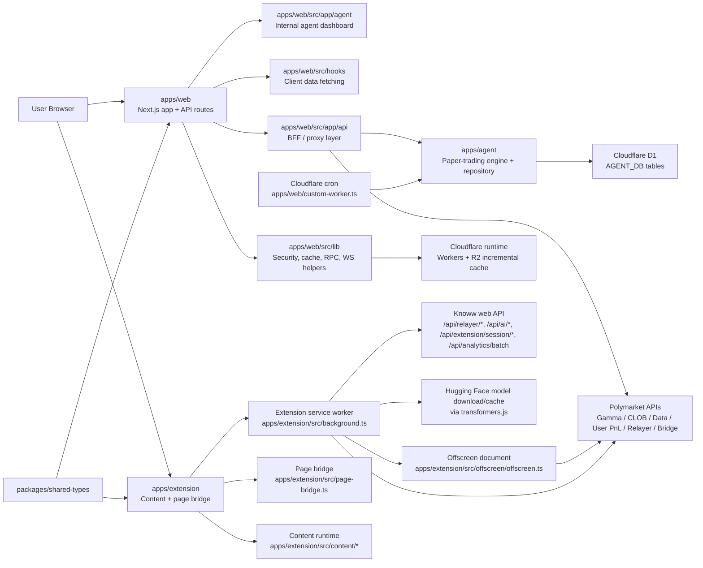
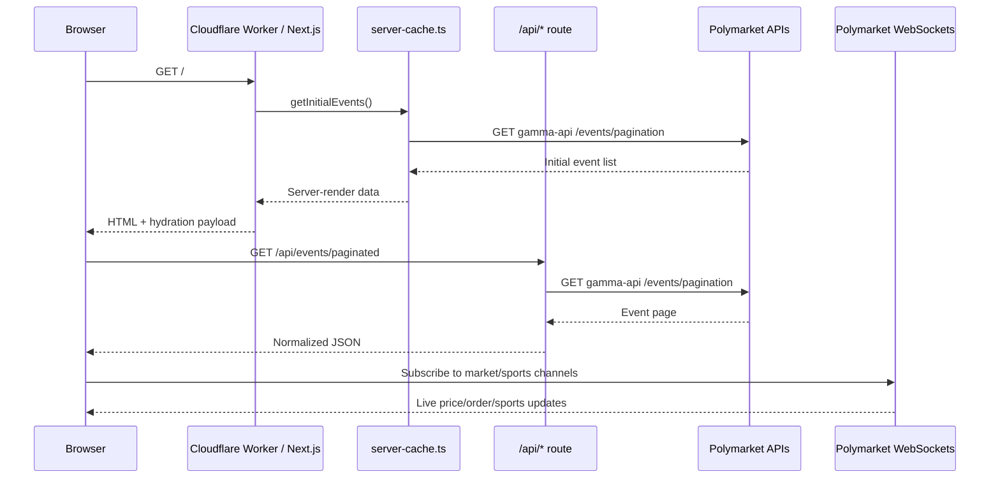
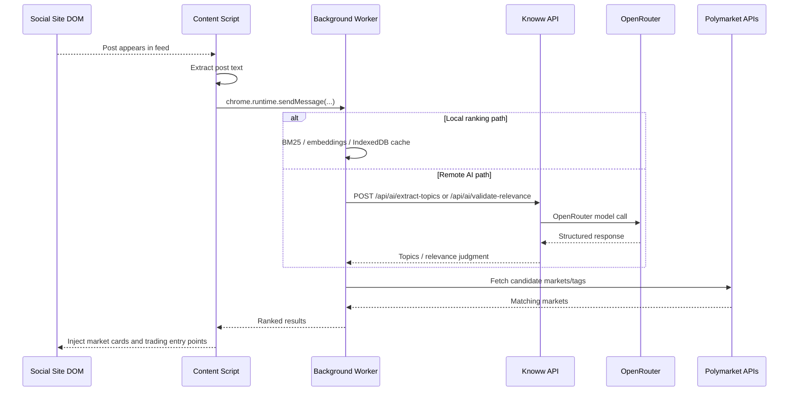
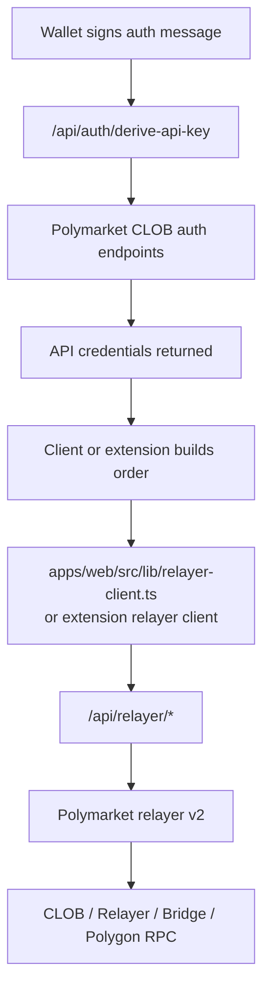

# Knoww Architecture

This document explains how the `polycaster` repository is put together for a new engineer joining the team.

## 1. System Overview

### What this project does

Knoww is a prediction-markets product built on top of Polymarket.

It has three active product/operator surfaces:

- `apps/web`: the public web app at `knoww.app`, where users browse markets, view portfolios, inspect whale activity, and place trades.
- `apps/extension`: a Chrome extension that injects relevant prediction-market cards into supported social, community, editorial, and streaming sites and can initiate trading flows from those pages.
- `apps/web/src/app/agent`: an internal operator dashboard for the paper-trading agent and its supporting admin APIs.

There is also one active scheduled runtime path:

- `apps/web/custom-worker.ts`: the Cloudflare Worker entrypoint that serves the OpenNext app and runs the agent cron tick on the configured schedule.

### Who uses it

- End users browsing prediction markets on the web app
- Traders connecting Polygon wallets and placing Polymarket orders
- Extension users reading social, community, editorial, finance, sports, prediction-native, and streaming sites such as X/Twitter, LinkedIn, Reddit, Farcaster, Bluesky, Discord, Hacker News, Stack Overflow, Quora, Product Hunt, Lemmy, Kalshi, Manifold, Twitch, and crypto/news sites and discovering related markets inline

### Problems it solves

- Makes Polymarket data easier to browse than Polymarket’s raw APIs
- Adds web-app views that combine multiple upstream Polymarket APIs into a single UI
- Hides sensitive builder-signing credentials behind first-party proxy routes
- Lets users discover markets in-context on social, community, editorial, and streaming sites instead of manually searching

### Repository shape

| Path | Role |
| --- | --- |
| `apps/web` | Next.js 15 App Router frontend, deployed to Cloudflare Workers via OpenNext |
| `apps/extension` | MV3 browser extension with content scripts, service worker, and offscreen trading runtime |
| `apps/agent` | Shared paper-trading engine, D1 repository, search/LLM orchestration, and settlement logic consumed by the web admin surface |
| `apps/agent/migrations` | Versioned SQL migrations for the agent-owned D1 schema |
| `apps/web/e2e`, `apps/extension/tests` | Browser and node-based regression coverage for the web app and extension |
| `packages/logger` | Shared structured logger used by the web app, extension, and agent package |
| `packages/shared-types` | Shared constants, contract addresses, ABIs, trading helpers, and Polymarket endpoint definitions used across the monorepo |

## 2. Component Map

### High-level runtime map



### Main modules and responsibilities

| Module | Key paths | Responsibility | Talks to |
| --- | --- | --- | --- |
| Web app shell | `apps/web/src/app/layout.tsx`, `apps/web/src/app/page.tsx`, `apps/web/src/app/home-content.tsx` | Renders the public site, bootstraps providers, and serves both the marketing landing experience and the main market-browsing pages | Hooks, contexts, server-cache, API routes |
| Web feature components | `apps/web/src/components/*`, `apps/web/src/components/comments/*`, `apps/web/src/components/deposit/*`, `apps/web/src/components/landing/*`, `apps/web/src/components/leaderboard/*`, `apps/web/src/components/notifications/*`, `apps/web/src/components/portfolio/*`, `apps/web/src/components/sportsbook/*`, `apps/web/src/components/trading/*`, `apps/web/src/components/ui/*`, `apps/web/src/hooks/use-price-alerts.ts` | Houses reusable UI primitives plus feature-level views for landing-page storytelling, comments, deposits, leaderboard, portfolio, sportsbook/live-sports surfaces, notifications, hook-driven price alerting, and trading flows | App shell, hooks, contexts, wallet state |
| Web UI state | `apps/web/src/context/*` | Client-only UI state for wallet, filters, onboarding, and trading | React components and hooks |
| Marketing theme runtime | `apps/web/src/components/kw-theme.tsx`, `apps/web/src/components/kw-theme-state.ts`, `apps/web/src/components/landing/landing-shell.tsx` | Owns the marketing/editorial theme system layered on top of `next-themes`, including the landing-page theme shell and migration from the legacy landing-only theme key | Marketing pages, `ThemeProvider`, localStorage |
| Web wallet and session auth | `apps/web/src/config/index.tsx`, `apps/web/src/lib/auth/*`, `apps/web/src/lib/extension-auth.ts`, `apps/web/src/lib/siwx/*` | Configures Reown/Wagmi wallet bootstrapping, SIWX challenge generation, extension CORS/session helpers, and extension-session token issuance/verification used by relayer-proxy and `/api/extension/session/*` flows | Wallet providers, API routes, browser sessions |
| Web data hooks | `apps/web/src/hooks/*` | Wraps fetches to `/api/*`, React Query state, websocket subscriptions, trading helpers | App Router API routes, websocket managers |
| Web realtime and account UX | `apps/web/src/app/live/page.tsx`, `apps/web/src/app/events/sports/live/page.tsx`, `apps/web/src/app/sports/live/page.tsx`, `apps/web/src/components/notifications/*`, `apps/web/src/hooks/use-price-alerts.ts`, `apps/web/src/app/whales/_components/*`, `apps/web/src/app/whales/_lib/*` | Powers live sports markets across the current live-route aliases, CLOB notification surfaces, hook-driven browser price-alert detection, and whale-specific dashboards/aggregations | Web data hooks, websocket managers, Polymarket CLOB |
| Agent operator dashboard | `apps/web/src/app/agent/page.tsx`, `apps/web/src/app/agent/agent-dashboard-client.tsx` | Internal UI for managing watchlist items, triggering runs, reviewing evidence/votes, inspecting paper positions, live-order audits, and model calibration | Agent admin APIs, `apps/agent`, D1 |
| API/BFF layer | `apps/web/src/app/api/**/*/route.ts` | Validates input, rate-limits requests, calls upstream services, reshapes responses for the UI, and also exposes same-origin infrastructure endpoints such as the signed image optimizer proxy at `/api/image` | Polymarket APIs, OpenRouter, relayer proxy, Polygon RPC, shared image optimizer |
| Agent admin API helpers | `apps/web/src/lib/agent/api.ts`, `apps/web/src/lib/agent/repository.ts`, `apps/web/src/app/api/agent/**/*/route.ts` | Enforces admin auth/origin checks, binds Cloudflare D1 when available, and exposes the paper-trading control plane over `/api/agent/*` | Agent dashboard, `apps/agent`, D1, origin guard |
| Agent engine package | `apps/agent/src/*` | Owns watchlist import, evidence gathering, model voting, quorum, paper/live execution adapters, resolution refresh, and the repository schema used by `/api/agent/*` | Web admin APIs, Polymarket APIs, OpenRouter/search providers, D1 |
| Web infra helpers | `apps/web/src/lib/*` | Caching, origin checks, auth helpers, websocket managers, server-side fetch memoization, RPC utilities, PostHog server capture | Cloudflare Worker runtime, browser, upstream APIs, PostHog |
| Worker entrypoint and cron | `apps/web/custom-worker.ts`, `apps/web/wrangler.jsonc` | Boots the OpenNext Worker, exposes the `fetch` handler, and runs scheduled agent ticks against the D1-backed repository | OpenNext output, `apps/agent`, D1, Cloudflare cron |
| Insider detection and backtesting | `apps/web/src/lib/insider/*`, `apps/web/src/app/api/whales/backtest/route.ts` | Scores suspicious trading with archetype-based detectors, replays the same logic against resolved markets, and exposes the heavyweight backtest API used by the whales backtest UI | Polymarket Gamma/Data/CLOB APIs, trader-history cache, whales pages |
| Web constants and types | `apps/web/src/constants/*`, `apps/web/src/types/*` | Shared Polymarket constants, API enums, cache durations, and typed response shapes used across routes, hooks, and components | Web app shell, API routes, hooks |
| Web platform guards | `apps/web/src/middleware.ts`, `apps/web/instrumentation-client.ts` | Applies security headers/CSP and bootstraps browser-side telemetry | Browser, Next.js runtime, PostHog |
| Extension content runtime | `apps/extension/src/content/index.ts`, `apps/extension/src/content/*`, `apps/extension/src/content/streaming/stream-markets.ts` | Bundles the content-script pipeline, detects supported sites, extracts post/article text, ranks relevant markets, and also powers stream-surface companion cards such as Twitch's Live Markets module | Background service worker, page bridge, Knoww APIs, Polymarket APIs |
| Extension in-page trading bridge | `apps/extension/src/content/trading/*`, `apps/extension/src/page-bridge.ts` | Manages content-script trading UI, extension-session bootstrapping, proxy-wallet bridging, and page-world wallet RPC handoff for inline trading flows | Content runtime, background worker, page bridge, `/api/extension/session/*`, `/api/relayer/*` |
| Extension background worker | `apps/extension/src/background.ts`, `apps/extension/src/background/*` | Central message router, auth token storage, batched analytics queue, CORS-safe fetch proxy, local NLP/embedding services | Content scripts, offscreen document, Knoww API, analytics ingest proxy, Polymarket APIs |
| Extension page bridge | `apps/extension/src/page-bridge.ts` | Runs in the page's main world to discover injected wallets via EIP-6963 and bridge EIP-1193 RPC requests between page wallets and the isolated content script | Content runtime, injected wallet providers |
| Extension platform and host config | `apps/extension/src/supported-hosts.ts`, `apps/extension/src/content/platform-registry.ts`, `apps/extension/src/content/platforms/*` | Defines match patterns, platform adapters, and site-specific extraction/injection behavior for supported social, editorial, prediction-native, and streaming surfaces | Content runtime, background worker |
| Extension offscreen runtimes | `apps/extension/src/offscreen/offscreen.ts`, `apps/extension/src/offscreen/scoring-runtime.ts`, `apps/extension/src/offscreen/trading-runtime.ts`, `apps/extension/src/background/trading-handler.ts` | Splits heavy scoring and trading work out of the MV3 service worker, loading runtime-specific modules only when needed | Background worker, relayer, CLOB, Polygon RPC, local scoring pipeline |
| Extension options and preferences | `apps/extension/src/options.tsx`, `apps/extension/src/content/preferences.ts`, `apps/extension/src/types/settings.ts` | Manages per-user platform/source toggles, analytics preferences, theme overrides, and debug settings | Chrome storage, content runtime, background worker |
| Extension sidepanel | `apps/extension/src/sidepanel.ts` | Renders the extension-owned sidepanel UI for snapshot markets, search, portfolio, and wallet-session controls outside the in-page injection flow | Background worker, Knoww API, Chrome extension runtime |
| Shared logger package | `packages/logger/src/index.ts` | Provides the structured logger used across the web app, extension, and agent package instead of ad hoc console logging | Web app routes/libs, extension background/content runtimes, `apps/agent` |
| Shared market/contracts package | `packages/shared-types/src/*` | Single source of truth for Polymarket endpoints, contract addresses, auth constants, slippage helpers, crypto helpers, trading helpers, ABIs, and shared types | Web app, extension, and agent package |
| Deployment config | `apps/web/custom-worker.ts`, `apps/web/wrangler.jsonc`, `apps/web/open-next.config.ts`, `apps/web/next.config.ts` | Packages the Next.js app for Cloudflare Workers, wires the custom Worker entrypoint, and configures the R2-backed incremental cache plus cron schedule | Cloudflare Workers, R2 |

### Important page surfaces

| Page | Key path | Purpose |
| --- | --- | --- |
| Home | `apps/web/src/app/page.tsx` | Public marketing landing page for the product and extension |
| Markets home | `apps/web/src/app/home-content.tsx` | Main market-browsing experience with persisted view-mode state |
| Event listing by tag | `apps/web/src/app/events/[tag]/page.tsx` | Category/tag-driven event browsing |
| Event detail | `apps/web/src/app/events/detail/[slug]/page.tsx` | Event-level market list and event metadata view |
| Sports hub | `apps/web/src/app/events/sports/page.tsx` | Sports-specific event and market discovery landing page |
| Sports by league | `apps/web/src/app/events/sports/[sport]/page.tsx` | League- or sport-specific sports browsing |
| Sports live | `apps/web/src/app/events/sports/live/page.tsx` | Primary live sports view with websocket-backed game state |
| Markets index | `apps/web/src/app/markets/page.tsx` | Top-level market browsing and discovery page |
| Market detail | `apps/web/src/app/markets/[slug]/page.tsx` | Detailed market trading and order book UI |
| Portfolio | `apps/web/src/app/portfolio/page.tsx` | Positions, orders, trades, P&L, deposit/withdraw |
| Live alias | `apps/web/src/app/live/page.tsx` | Shortcut route for the live sports experience |
| Sports live alias | `apps/web/src/app/sports/live/page.tsx` | Additional alias route for the live sports experience |
| Search | `apps/web/src/app/search/page.tsx` | Client-side market discovery with recent-search persistence |
| Whales | `apps/web/src/app/whales/page.tsx` | Whale activity and suspicious/insider activity analysis |
| Whale backtest | `apps/web/src/app/whales/backtest/page.tsx` | Runs the insider-detector backtest UI against recently resolved markets |
| Agent dashboard | `apps/web/src/app/agent/page.tsx` | Internal control panel for watchlist curation, agent runs, calibration, positions, and resolution refreshes |
| Leaderboard | `apps/web/src/app/leaderboard/page.tsx` | Trader leaderboard |
| Profile | `apps/web/src/app/profile/[address]/page.tsx` | Public trader profile views |
| Privacy | `apps/web/src/app/privacy/page.tsx` | User-facing privacy and data-retention disclosures |

## 3. Data Flow

### 3.1 Typical web request: home page and market browsing

The web app mostly behaves like a backend-for-frontend over Polymarket’s public APIs.

1. A browser request hits the Cloudflare Worker generated from `apps/web`.
2. Server Components fetch initial data on the edge, mainly through `apps/web/src/lib/server-cache.ts`.
3. After hydration, client hooks fetch richer data from `apps/web/src/app/api/*`.
4. Those API routes validate input, apply per-route in-memory rate limiting, call upstream Polymarket APIs, and normalize responses for React components.
5. Websocket managers subscribe directly to Polymarket websocket endpoints for live updates.



Relevant files:

- `apps/web/src/app/page.tsx`
- `apps/web/src/lib/server-cache.ts`
- `apps/web/src/hooks/use-paginated-events.ts`
- `apps/web/src/app/api/events/paginated/route.ts`
- `apps/web/src/lib/websocket-manager.ts`
- `apps/web/src/lib/sports-websocket-manager.ts`

### 3.2 Typical extension request: social post to inline market card

1. The extension content bundle starts from `apps/extension/src/content/index.ts`, which wires together the content runtime modules before handing off to `apps/extension/src/content/main.ts`.
2. Platform detection comes from `apps/extension/src/content/platform-registry.ts` and platform adapters under `apps/extension/src/content/platforms/*`.
3. When a page needs wallet access, `apps/extension/src/page-bridge.ts` runs in the page's main world so the extension can discover injected providers and bridge EIP-1193 requests safely into the isolated content script.
4. The content script extracts post text and asks the background worker for local NLP ranking or remote AI extraction.
5. The background worker either:
   - runs local NLP / embeddings from `apps/extension/src/background/nlp.ts` and `apps/extension/src/background/embeddings.ts`, or
   - calls Knoww’s AI routes at `/api/ai/extract-topics` and `/api/ai/validate-relevance`.
6. The extension fetches candidate markets from Polymarket (and optionally Kalshi), ranks them, and injects UI into the feed DOM.



Relevant files:

- `apps/extension/src/content/index.ts`
- `apps/extension/src/content/main.ts`
- `apps/extension/src/content/api.ts`
- `apps/extension/src/content/platform-registry.ts`
- `apps/extension/src/page-bridge.ts`
- `apps/extension/src/background.ts`
- `apps/extension/src/background/nlp.ts`
- `apps/extension/src/background/embeddings.ts`
- `apps/web/src/app/api/ai/extract-topics/route.ts`
- `apps/web/src/app/api/ai/validate-relevance/route.ts`

### 3.3 Trading and signing flow

There are two variants, but both rely on the same security idea: signing secrets stay server-side.

#### Web app

1. The browser uses wallet providers configured in `apps/web/src/config/index.tsx`.
2. When CLOB credentials are needed, `useClobCredentials()` signs Polymarket’s EIP-712 auth message and calls `/api/auth/derive-api-key`.
3. The route creates or derives API credentials from Polymarket CLOB.
4. When gasless Safe execution is needed, the client uses `apps/web/src/lib/relayer-client.ts` and the hooks built on top of it.
5. `/api/relayer/[...path]` validates same-origin browser requests or extension bearer sessions, then proxies the allow-listed relayer calls with server-only relayer credentials.

#### Extension

1. The extension first creates a signed session via `/api/extension/session/challenge` and `/api/extension/session/verify`.
2. The background worker stores the resulting bearer token in `chrome.storage.session`.
3. The offscreen document executes trading actions through `apps/extension/src/background/trading-handler.ts`.
4. The extension relayer client in `apps/extension/src/background/relayer-client.ts` calls `knoww.app/api/relayer/*` using the extension bearer token.
5. The offscreen trading layer then talks to Polymarket CLOB, the relayer proxy, Bridge, and Polygon RPC as needed.



Relevant files:

- `apps/web/src/hooks/use-clob-credentials.ts`
- `apps/web/src/app/api/auth/derive-api-key/route.ts`
- `apps/web/src/lib/relayer-client.ts`
- `apps/web/src/hooks/use-relayer-client.ts`
- `apps/web/src/lib/auth/extension-session.ts`
- `apps/web/src/app/api/extension/session/challenge/route.ts`
- `apps/web/src/app/api/extension/session/verify/route.ts`
- `apps/web/src/app/api/relayer/[...path]/route.ts`
- `apps/extension/src/background/trading-handler.ts`
- `apps/extension/src/background/relayer-client.ts`
- `apps/extension/src/offscreen/offscreen.ts`

## 4. Database Schema and Persistent Storage

### The important truth first

Most user-facing market data is still fetched live from Polymarket APIs, but the repo now also owns a small operational data model for the paper-trading agent.

Persistence inside this repo currently falls into four buckets:

- Agent-owned D1 tables for watchlist, runs, run items, resolutions, positions, and live-order audits
- OpenNext-generated cache metadata used at build/runtime
- Browser storage in the web app
- Browser storage in the extension

### 4.1 Agent-owned D1 schema

The application-owned schema lives inside `apps/agent/src/repository.ts`, its versioned SQL migrations live in `apps/agent/migrations/*.sql`, and the repository is bound in `apps/web/src/lib/agent/repository.ts` through the `AGENT_DB` Cloudflare D1 binding.

| Table | Defined in | Purpose | Keys / indexes | Relationships |
| --- | --- | --- | --- | --- |
| `agent_watchlist` | `apps/agent/src/repository.ts` | Stores operator-curated watchlist items and imported market metadata | Primary key `id`; active/created indexes | Referenced by runs, positions, and live orders |
| `agent_runs` | `apps/agent/src/repository.ts` | Stores top-level paper-trading run lifecycle rows | Primary key `id`; `started_at` index | Parent for `agent_run_items` |
| `agent_run_items` | `apps/agent/src/repository.ts` | Persists per-watchlist evidence, votes, decisions, and fill snapshots for a run | Primary key `id`; `run_id` and `watchlist_item_id` indexes | Foreign keys to `agent_runs.id` and `agent_watchlist.id` |
| `agent_resolutions` | `apps/agent/src/repository.ts` | Stores fetched market outcomes used for settlement/calibration | Primary key `token_id`; `resolved_at` index | Joined back to watchlist/run items by token |
| `agent_positions` | `apps/agent/src/repository.ts` | Tracks paper positions, closes, and realized P&L | Primary key `id`; token/status/watchlist indexes | Foreign key to `agent_watchlist.id` |
| `agent_live_orders` | `apps/agent/src/repository.ts` | Audit log for live-mode order submission attempts and status changes | Primary key `idempotency_key`; created/status indexes | Linked logically to runs/watchlist items |

Notes:

- When D1 is unavailable, the repository falls back to an in-memory implementation for local/dev resilience.
- This schema is operational state for the internal agent, not the primary source of truth for Polymarket market data.

### 4.2 Generated SQL schema found in the repository

There is also generated cache bookkeeping SQL at:

- `apps/web/.open-next/cloudflare/cache-assets-manifest.sql`

This file is generated by OpenNext/Cloudflare, not by product feature code.

| Table | Defined in | Purpose | Keys / indexes | Relationships |
| --- | --- | --- | --- | --- |
| `tags` | `apps/web/.open-next/cloudflare/cache-assets-manifest.sql` | Maps cache invalidation tags to asset paths | `UNIQUE(tag, path) ON CONFLICT REPLACE` | None |
| `revalidations` | `apps/web/.open-next/cloudflare/cache-assets-manifest.sql` | Records the latest revalidation time for a tag | `UNIQUE(tag) ON CONFLICT REPLACE` | Logical relationship to `tags.tag`, but no foreign key |

Notes:

- This schema is for incremental cache bookkeeping, not market, user, order, or comment data.
- The app’s actual cached page payloads are stored in the R2 bucket bound as `NEXT_INC_CACHE_R2_BUCKET` in `apps/web/wrangler.jsonc`.

### 4.3 Web-app browser storage

| Storage | Key shape | Defined in | Purpose |
| --- | --- | --- | --- |
| `sessionStorage` | `polymarket_api_creds_<clobBaseUrl>_<address>` | `apps/web/src/hooks/use-clob-credentials.ts` | Stores derived CLOB API credentials for the current browser session, namespaced by the active CLOB host |
| `sessionStorage` | `homeViewMode` | `apps/web/src/app/home-content.tsx` | Remembers the home-page view mode for the active tab |
| `localStorage` | search-related keys | `apps/web/src/app/search/page.tsx`, `apps/web/src/components/market-search.tsx` | Stores recent searches / last-viewed search results |
| `localStorage` | `knoww_onboarding_complete_<address>` | `apps/web/src/context/onboarding-context.tsx` | Remembers that a wallet completed trading onboarding |
| `localStorage` | `theme` (with legacy migration from `knoww-landing-theme`) | `apps/web/src/components/kw-theme.tsx`, `apps/web/src/components/landing/landing-shell.tsx` | Persists the marketing/app theme selected through `next-themes` |
| `localStorage` | `price-alerts-storage` | `apps/web/src/hooks/use-price-alerts.ts` | Persists browser-side price alert configuration |
| `localStorage` | `trading_session_*` envelope keys | `apps/web/src/lib/session.ts` | Persists signed trading-session metadata with integrity checks |

### 4.4 Extension browser storage

| Storage | Structure | Defined in | Purpose |
| --- | --- | --- | --- |
| `chrome.storage.session` | `knoww_extension_access_token` | `apps/extension/src/background/extension-session.ts` | Stores short-lived extension bearer token for Knoww API access |
| `chrome.storage.session` | arbitrary credential keys | `apps/extension/src/background.ts` | Keeps trading credentials behind the service-worker boundary |
| `chrome.storage.sync` | `knowwSettings` | `apps/extension/src/options.tsx` | Syncs user settings across browsers/profiles |
| `chrome.storage.local` | `knowwPreferences` and related UI prefs | `apps/extension/src/content/preferences.ts` | Keeps local-only extension preferences |
| `chrome.storage.local` | `knoww_analytics_queue_v1`, `knoww_analytics_install_id_v1` | `apps/extension/src/background/analytics.ts` | Buffers optional extension analytics before batch upload |
| IndexedDB | DB `knoww-embeddings`, store `vectors` | `apps/extension/src/background/embeddings.ts` | Persists local text embeddings for relevance ranking |

### 4.5 IndexedDB structure used by the extension

The extension’s IndexedDB layer is the closest thing to an application-defined data store in this repo.

Defined in `apps/extension/src/background/embeddings.ts`:

- Database name: `knoww-embeddings`
- Version: `2`
- Object store: `vectors`
- Primary key: `text`
- Secondary index: `ts`

Stored shape:

```ts
interface IDBEntry {
  text: string;   // keyPath
  vector: number[];
  ts: number;     // indexed timestamp for pruning
}
```

Behavior:

- Entries expire after 7 days
- Store is capped at 2,000 entries
- Old entries are pruned by timestamp using the `ts` index

## 5. External Dependencies

### Core service integrations

| Dependency | Where used | Why it exists |
| --- | --- | --- |
| Polymarket Gamma API | `apps/web/src/app/api/events/*`, `apps/web/src/app/api/tags/*`, `apps/web/src/app/api/comments/route.ts`, `apps/web/src/lib/insider/resolved-markets.ts`, `apps/extension/src/content/api.ts` | Market/event/tag/comment discovery plus resolved-market selection for insider backtesting |
| Polymarket CLOB API | `apps/web/src/app/api/auth/derive-api-key/route.ts`, `apps/web/src/app/api/markets/*`, `apps/web/src/lib/insider/price-history.ts`, `apps/extension/src/background/trading-handler.ts` | Order books, prices, price-history lookups for timing clusters, API-key auth, order placement support |
| Polymarket Data API | `apps/web/src/app/api/user/*`, `apps/web/src/app/api/leaderboard/route.ts`, `apps/web/src/app/api/profile/[address]/route.ts`, `apps/web/src/app/api/whales/*`, `apps/web/src/lib/insider/backtest.ts` | Portfolio, trader stats, leaderboard, composite profile data, whale activity, and historical trade scans for insider backtesting |
| Polymarket User PnL API | `apps/web/src/app/api/user/pnl/route.ts`, `apps/web/src/app/api/user/pnl-history/route.ts`, `apps/web/src/app/api/profile/[address]/route.ts` | Time-series and aggregate P&L |
| Polymarket Relayer | `apps/extension/src/background/relayer-client.ts` | Safe transaction execution for extension trading |
| Polymarket Bridge API | `apps/web/src/hooks/use-bridge.ts`, `apps/extension/src/content/trading/bridge-api.ts` | Deposit/withdraw and supported asset quoting |
| Polymarket WebSockets | `apps/web/src/lib/websocket-manager.ts`, `apps/web/src/lib/sports-websocket-manager.ts` | Live market and sports updates |
| Polygon RPC / Alchemy | `apps/web/src/app/api/rpc/polygon/route.ts`, `apps/web/src/lib/rpc.ts`, `apps/web/src/config/index.tsx`, `apps/extension/src/background/trading-handler.ts` | On-chain reads and trading wallet checks |
| OpenRouter | `apps/web/src/app/api/ai/extract-topics/route.ts`, `apps/web/src/app/api/ai/validate-relevance/route.ts` | LLM-powered topic extraction and relevance filtering |
| PostHog | `apps/web/src/lib/posthog-server.ts`, `apps/web/src/app/api/analytics/batch/route.ts`, `apps/extension/src/background/analytics.ts` | Optional web/server and extension analytics capture |
| Hugging Face transformers.js | `apps/extension/src/background/embeddings.ts` | Local embedding model for extension relevance ranking |
| Reown / WalletConnect | `apps/web/src/config/index.tsx`, `apps/web/src/context/index.tsx` | Wallet connection and session management |
| Cloudflare Workers + OpenNext | `apps/web/wrangler.jsonc`, `apps/web/open-next.config.ts` | Edge runtime for the web app |
| Cloudflare R2 incremental cache | `apps/web/open-next.config.ts`, `apps/web/wrangler.jsonc` | Stores Next.js incremental cache artifacts |

### Things that are notably absent

- No Redis or Memcached layer in repo
- No Kafka, SQS, Pub/Sub, or other message queue
- No internal microservice mesh; the API layer is inside the Next.js app itself

## 6. Key Design Decisions

### 6.1 Backend-for-frontend instead of a separate backend service

Pattern: BFF / thin proxy layer

Why:

- The product mostly reshapes data from Polymarket rather than owning the source of truth
- App Router API routes are enough for validation, rate limiting, auth, and response shaping
- Keeping the BFF inside `apps/web` simplifies deployment on Cloudflare Workers

Where to see it:

- `apps/web/src/app/api/**/*/route.ts`

### 6.2 Mostly external market data, selectively owned operational state

Pattern: external source of truth + targeted owned state

Why:

- Markets, comments, positions, trades, and P&L already live in Polymarket systems
- Knoww still avoids mirroring the full Polymarket product graph in its own database
- The paper-trading agent does need durable local state for watchlists, run history, positions, resolutions, and live-order audit trails
- Session-lifetime data such as derived API credentials is stored close to the browser that needs it

Where to see it:

- `apps/agent/src/repository.ts`
- `apps/web/src/lib/agent/repository.ts`
- `apps/web/src/hooks/use-clob-credentials.ts`
- `apps/extension/src/background/extension-session.ts`
- `apps/extension/src/background/embeddings.ts`

### 6.3 Server-side proxying for secrets

Pattern: secret-hiding proxy

Why:

- `ALCHEMY_API_KEY`, `INTERNAL_AUTH_TOKEN`, and `EXTENSION_SESSION_SECRET` must not reach the browser bundle
- `/api/rpc/polygon` hides the RPC key
- `/api/relayer/*` hides the relayer API key and relayer key owner address

Where to see it:

- `apps/web/src/app/api/rpc/polygon/route.ts`
- `apps/web/src/app/api/relayer/[...path]/route.ts`
- `apps/web/src/lib/origin-guard.ts`

### 6.4 Shared package for protocol constants

Pattern: shared kernel package

Why:

- The web app and extension must agree on Polymarket endpoints, contract addresses, and auth message constants
- Keeping them in one package avoids drift between surfaces

Where to see it:

- `packages/shared-types/src/polymarket.ts`
- `packages/shared-types/src/contracts.ts`
- `packages/shared-types/src/ctf.ts`

### 6.5 Edge-first rendering and caching

Pattern: edge SSR + fetch revalidation + R2 incremental cache

Why:

- Initial page loads benefit from edge rendering and cached fetches
- Many pages are read-heavy and can tolerate short revalidation windows
- OpenNext + Cloudflare R2 provides deployment-compatible incremental caching

Where to see it:

- `apps/web/src/app/page.tsx`
- `apps/web/src/lib/server-cache.ts`
- `apps/web/open-next.config.ts`
- `apps/web/wrangler.jsonc`

### 6.6 Singleton websocket managers on the client

Pattern: shared connection manager

Why:

- Multiple components need the same realtime feeds
- Singleton managers prevent duplicate websocket connections and centralize reconnect logic

Where to see it:

- `apps/web/src/lib/websocket-manager.ts`
- `apps/web/src/lib/sports-websocket-manager.ts`

### 6.7 MV3 extension split into content, background, and offscreen runtimes

Pattern: browser-extension runtime separation

Why:

- Content scripts can touch the page DOM but should stay lightweight
- The MV3 service worker is good for routing and storage, but not heavy crypto bundles
- The offscreen document hosts `viem`-based trading and the unified CLOB client without bloating the service worker lifecycle

Where to see it:

- `apps/extension/src/content/*`
- `apps/extension/src/background.ts`
- `apps/extension/src/offscreen/offscreen.ts`
- `apps/extension/src/background/trading-handler.ts`

### 6.8 Local-first extension relevance pipeline with remote AI fallback/enrichment

Pattern: hybrid on-device + remote AI inference

Why:

- Local NLP and embeddings reduce latency and repeated remote calls
- Remote AI routes improve semantic extraction when simple keyword matching is not enough
- IndexedDB and in-memory caches keep extension performance acceptable across large feeds

Where to see it:

- `apps/extension/src/background/nlp.ts`
- `apps/extension/src/background/embeddings.ts`
- `apps/web/src/app/api/ai/extract-topics/route.ts`
- `apps/web/src/app/api/ai/validate-relevance/route.ts`

## Practical takeaways for new contributors

- Treat `apps/web` as a combined frontend and BFF, not as a frontend talking to an internal backend.
- Treat Polymarket as the main source of truth for market and trading data.
- If you are looking for business tables or migrations, start with `apps/agent/src/repository.ts` and `apps/agent/migrations/*.sql`.
- Be careful with secrets: the code intentionally routes sensitive operations through server-side proxies.
- If you change a protocol constant, contract address, or API endpoint, check `packages/shared-types` first so both the web app and extension stay in sync.
