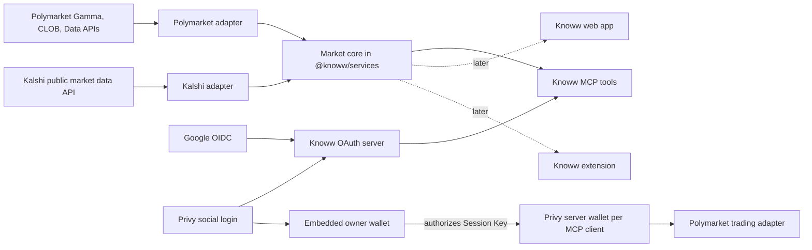

# Single API layer for multi-platform prediction markets

Status: Accepted design. Decisions settled with the owner on 2026-09-02.

Date: 2026-09-01, updated 2026-09-02

## Decision summary

Knoww will expose one MCP server and one normalized market contract across
prediction-market platforms. Platforms connect through adapters in
`@knoww/services` instead of defining separate public APIs.

The settled decisions are:

- Keep one MCP resource at `https://mcp.knoww.app/mcp`.
- Put the normalized market model, adapters, and aggregation in
  `@knoww/services`. The MCP server is the first consumer. The web app and the
  extension adopt the same services later, without a rewrite, but no web or
  extension search path changes in this build.
- Support two platforms: Polymarket (market data and trading, refactoring the
  code that exists) and Kalshi (market data only). Limitless and Robinhood are
  out of scope; see "Platforms not in scope".
- Name tools by what they cover. Tools whose concept exists on more than one
  platform use neutral names with a `platform` filter. Tools that belong to
  one platform's data model get a platform prefix. The 20 tools that exist
  today keep their names and response shapes forever as permanent aliases.
- Normalize prices to decimal strings in the 0 to 1 range, map every platform
  status onto one seven-state enum that includes `resolving`, and add canonical
  `platform:sourceId` identifiers to responses without removing any current
  field.
- Search by live fan-out to every enabled platform, 20 markets per page, on the
  opaque cursor format the MCP tools already use. There is no indexed catalog.
- Never merge markets across platforms. A search returns every matching
  market from every platform as its own result.
- Keep Google OpenID Connect as the login for read-only MCP grants. Add Privy
  social login for MCP grants that include account or order scopes. Knoww OAuth
  remains the authorization server that issues every MCP token.
- Trade on Polymarket only, through a Privy server wallet per MCP client that
  the user's embedded wallet authorizes as a Polymarket Session Key. A Session
  Key can create and cancel orders and cannot withdraw funds.
- Charge a builder-code taker fee on every Polymarket order placed through
  MCP from day one. Subscription tiers and x402 come later; the codebase keeps
  the plug point.

This document is the target architecture. Production trading still depends on
the Polymarket compatibility test and the Kalshi conversation described below.

## Goals

- Let users and agents discover markets from Polymarket and Kalshi through a
  single API.
- Provide stable identifiers and a consistent response format.
- Preserve platform-specific rules where normalization would lose meaning.
- Build the market core once, in `@knoww/services`, so the web app and the
  extension can consume it later.
- Add platforms without adding switch statements to MCP tools.
- Support read-only platforms and trading-capable platforms in the same
  registry.
- Give social-login users an embedded wallet and a controlled path to agentic
  trading on Polymarket.
- Keep venue credentials, wallet keys, and trading authority out of the MCP
  client and model context.
- Never break an MCP client that already calls one of the 20 existing tools.

## Non-goals

- Pretending every platform has the same order, settlement, or account model.
- Merging markets across platforms, whether by title, embedding, or a curated
  table.
- Indexing or caching platform catalogs in a Knoww database.
- Kalshi account, portfolio, or order tools of any kind in this build.
- Replacing Google OIDC for read-only MCP access.
- Linking an existing injected-wallet web user to a Privy identity in this
  build. That is a named roadmap decision; see "Existing wallet users".
- Using a connected blockchain network as proof of jurisdiction or eligibility.
- Enabling withdrawals, transfers, or redemptions through an MCP tool.
- Removing Reown from the existing injected-wallet web flow.
- Adapters for Limitless, Robinhood, or any third platform.

## System architecture



The MCP Worker is one consumer of the market core, not the place where
aggregation lives. Web and extension code call the Polymarket clients directly
today; they keep doing so until they are moved onto the shared services in a
later effort.

## Platform support and constraints

| Platform | Public market data | Account and trading | Status in this build |
| --- | --- | --- | --- |
| Polymarket | Gamma, CLOB, and Data APIs, no auth | Owner wallet plus CLOB Session Key delegation | Refactor the existing code into the adapter; trading via MCP is committed scope |
| Kalshi | `https://api.elections.kalshi.com/trade-api/v2`, no auth, cursor pagination | RSA-signed requests with a key pair tied to a KYC'd account; no delegate credential exists | Market data adapter only |

### Kalshi terms

Kalshi's Developer Agreement (v1.1 is the revision reviewed; whether it is
current is unconfirmed) prohibits caching, aggregating, or storing API data,
facilitating trading for other members, and sublicensing access. API use is
"expressly limited to facilitating a member's own trading". An MCP server that
redistributes Kalshi market data to third-party agents needs Kalshi's written
authorization.

The owner is opening a conversation with Kalshi in parallel with the adapter
work. The adapter is the same code either way. Until authorization lands:

- the Kalshi adapter runs with caching disabled; every call goes upstream;
- Kalshi is exposed through MCP only, not the web app;
- the platform registry can disable Kalshi through configuration without a
  deploy.

The conversation should ask for written authorization to redistribute market
data, whether Kalshi offers or plans a scoped delegate credential, and whether
any fee or revenue-share arrangement exists for third parties. Kalshi has no
documented equivalent of Polymarket's builder codes.

### Platforms not in scope

Limitless and Robinhood were in earlier drafts and are removed. Robinhood
routes its event contracts through Kalshi's exchange, so the Kalshi adapter
covers most of that catalog. Limitless requires partner approval for trading
and is a small venue. Neither gets an adapter until the owner schedules it. The
adapter contract is the only part of this design written with them in mind.

## Public MCP contract

### Naming policy

Tool names are the public API. Two names can share one handler, so aliases
are free and removing them earns nothing.

- A tool whose concept exists on more than one supported platform gets a
  neutral name and a `platform` filter: `search_markets`, `get_market`.
- A tool that belongs to one platform's data model gets that platform's prefix:
  `polymarket_get_market_holders`, `kalshi_*` when a Kalshi-only concept
  appears.
- Account and order tools get neutral names because a future platform
  partnership could support them. In this build only `platform: "polymarket"`
  is accepted.
- Every one of the 20 existing tools keeps its name, input schema, and response
  shape permanently. Where the canonical name differs, the old name is an
  alias. `tools/list` advertises both, and each alias description starts with
  "Alias of <canonical name>". Documentation presents the canonical name.
- Canonical IDs are added to responses. No existing response field is removed
  or renamed.

The alias table in code is the source of truth. Contract tests assert that
every legacy name still resolves.

### Tool disposition

Cross-platform tools, neutral names, `platform` filter optional:

| Tool | Notes |
| --- | --- |
| `list_platforms` | New. Health, enabled state, and capabilities per platform |
| `search_markets` | Existing name. Fans out to every enabled platform |
| `list_events` | Existing name. Kalshi events map onto the same shape |
| `get_market` | Existing name. Accepts canonical IDs; Polymarket slug, condition ID, and token ID inputs stay supported |
| `get_event` | Existing name. Takes one platform's event ID only; see "No cross-platform merging" |
| `get_orderbook` | Existing name |
| `get_price_history` | Existing name |
| `get_market_trades` | Existing name |

Polymarket-specific tools, prefixed canonical names, legacy names as permanent
aliases:

| Canonical name | Alias |
| --- | --- |
| `polymarket_get_market_quotes` | `get_market_quotes` |
| `polymarket_get_market_holders` | `get_market_holders` |
| `polymarket_get_open_interest` | `get_open_interest` |
| `polymarket_get_event_live_volume` | `get_event_live_volume` |
| `polymarket_get_trader_leaderboard` | `get_trader_leaderboard` |
| `polymarket_list_tags` | `list_tags` |
| `polymarket_list_sports_markets` | `list_sports_markets` |
| `polymarket_get_public_profile` | `get_public_profile` |
| `polymarket_get_wallet_positions` | `get_wallet_positions` |
| `polymarket_get_wallet_activity` | `get_wallet_activity` |
| `polymarket_get_closed_positions` | `get_closed_positions` |
| `polymarket_get_wallet_pnl` | `get_wallet_pnl` |
| `polymarket_get_wallet_portfolio_value` | `get_wallet_portfolio_value` |

The `get_wallet_*` tools read public Data API records for any address. They are
not the same as the account tools below, which read the authenticated
principal's own account.

Account and order tools, added in the trading phase, `platform` required:

- `get_account_positions`
- `get_account_activity`
- `get_account_orders` (orders placed through this connection only; see
  "Account read visibility")
- `get_account_pnl`
- `get_account_portfolio_value`
- `preview_order`
- `place_order`
- `cancel_order`

There is no `compare_markets` tool.

### Search request

```json
{
  "query": "Federal Reserve rate cut",
  "platforms": ["polymarket", "kalshi"],
  "status": "active",
  "closesBefore": "2026-12-31T23:59:59Z",
  "limit": 20,
  "cursor": "opaque-cursor"
}
```

`platforms` is optional. Omitting it searches every enabled platform. `limit`
defaults to 20 and cannot exceed 20. `status` takes a canonical status value.
There is no `chain` filter; Kalshi is not a chain venue and the platform filter
is the only routing input.

### Search response

Every result is one platform's market. A query for "fed rates" returns the
Polymarket markets and the Kalshi markets that match, each tagged with its
platform and canonical ID, and Knoww makes no claim that any two of them are
the same contract.

```json
{
  "markets": [
    { "id": "polymarket:0xbd31dc8a...", "platform": "polymarket", "title": "Fed decision in September?" },
    { "id": "kalshi:KXFED-26SEP-C25", "platform": "kalshi", "title": "Fed funds rate above 4.25% after the September meeting?" }
  ],
  "partial": false,
  "platformErrors": [],
  "nextCursor": "opaque-composite-cursor"
}
```

### Canonical identifiers

Every market and event carries a Knoww identifier that includes its source:

```text
polymarket:<conditionId>
kalshi:<market ticker>
```

Events follow the same rule with the platform's event identifier. A tool
accepts the canonical identifier returned by search:

```json
{
  "marketId": "kalshi:KXFED-26SEP-C25"
}
```

The response also includes `sourceMarketId` and `sourceEventId`. A bare source
ID is not safe because two platforms can use the same slug or number.

The current Polymarket `slug`, `conditionId`, and `tokenId` inputs stay
supported. Documentation presents canonical IDs as the preferred input.

### Canonical market model

The common model contains fields that keep the same meaning on both
platforms:

```ts
type PlatformId = "polymarket" | "kalshi";
type DecimalString = string;

interface DecimalAmount {
  value: DecimalString;
  unit: string; // the platform's own settlement unit, for example "USD" or the collateral token symbol
}

interface CanonicalOutcome {
  id: string; // platform:sourceOutcomeId
  sourceOutcomeId: string;
  label: string; // "Yes", "No", or the named outcome
  price?: DecimalString; // 0 to 1, the platform's last or mid price
  bestBid?: DecimalString; // 0 to 1
  bestAsk?: DecimalString; // 0 to 1
  isWinner?: boolean; // present only when status is "resolved"
}

interface CanonicalMarket {
  schemaVersion: "1";
  id: string;
  platform: PlatformId;
  sourceMarketId: string;
  sourceEventId?: string;
  title: string;
  description?: string;
  status: MarketStatus;
  outcomes: CanonicalOutcome[];
  openTime?: string;
  closeTime?: string;
  resolvedTime?: string;
  volume?: DecimalAmount;
  liquidity?: DecimalAmount;
  openInterest?: DecimalAmount;
  resolutionRules?: string;
  resolutionSource?: string;
  sourceUrl?: string;
  capabilities: MarketCapabilities;
  platformDetails?: PlatformMarketDetails;
  fetchedAt: string;
}
```

There is no `canonicalEventId` field. Cross-platform grouping does not exist.

#### Price unit

Every price and probability is a decimal string between 0 and 1. Polymarket is
native to this range. Kalshi's current API returns fixed-point dollar strings
in the same range, so the mapper validates and passes them through. Money and
quantities keep the platform's own unit in `DecimalAmount.unit`. Knoww uses
Decimal.js for every calculation.

#### Status

```ts
type MarketStatus =
  | "unopened"
  | "active"
  | "paused"
  | "closed"
  | "resolving"
  | "resolved"
  | "unknown";
```

`resolving` covers the band between trading close and final settlement where
an outcome is proposed, determined, disputed, or amended. An agent needs to
know a market is in its dispute window before treating a price as free money.

| Canonical | Kalshi | Polymarket |
| --- | --- | --- |
| `unopened` | `initialized` | not yet accepting orders and not closed |
| `active` | `active` | active and accepting orders |
| `paused` | `inactive` | active but not accepting orders |
| `closed` | `closed` | closed, no resolution proposed |
| `resolving` | `determined`, `disputed`, `amended` | closed with a proposed or disputed UMA resolution |
| `resolved` | `finalized` | resolved |
| `unknown` | anything else | anything else |

The exact Gamma flag combinations for each Polymarket row are pinned in
fixtures, as is every Kalshi status string. A mapper that meets an unlisted
value returns `unknown` and logs it; it never guesses.

`platformDetails` is a discriminated union on `platform`. It keeps Polymarket
condition and token IDs, Kalshi tickers, and other fields that do not belong on
every market.

### Capabilities

Every adapter declares what it supports, and every market carries the
declaration of its platform:

```ts
interface MarketCapabilities {
  marketData: boolean;
  orderbook: boolean;
  priceHistory: boolean;
  publicTrades: boolean;
  accountPositions: boolean;
  accountOrders: boolean;
  createOrder: boolean;
  cancelOrder: boolean;
  redeem: boolean;
  withdrawals: boolean;
}
```

| Capability | Polymarket | Kalshi |
| --- | --- | --- |
| marketData, orderbook, priceHistory, publicTrades | true | true |
| accountPositions, accountOrders | true (trading phase) | false |
| createOrder, cancelOrder | true (trading phase) | false |
| redeem, withdrawals | false | false |

`redeem` and `withdrawals` are false on both platforms because no MCP tool
performs them. `list_platforms` returns adapter health, enabled state, and
capabilities so an agent can avoid calling a tool the platform cannot serve.

## No cross-platform merging

Both platforms often list markets about the same real-world event. Polymarket
might list "Fed decision in September?" and Kalshi might list "Fed funds rate
above 4.25% after the September meeting?". Markets with near-identical titles
routinely resolve on different sources, deadlines, thresholds, and
definitions. If Knoww merged two markets that were not the same contract and
an agent traded the "cheaper" one, the agent would hold a contract that
resolves differently than it believes. That is a losing trade Knoww caused,
not a display bug.

So Knoww never merges. Concretely:

- `search_markets` returns each platform's markets as separate results.
- `get_event` takes one platform's event ID and returns that platform's event.
- There is no `compare_markets` tool and no canonical event group.
- An agent that wants to compare venues searches both and reads the resolution
  rules itself. Knoww makes no claim that anything matches.

If curated matching is ever wanted, it gets its own design document. It is not
part of this layer.

## Adapter contracts

Market data and trading adapters are separate interfaces. Kalshi implements
only the first.

```ts
interface MarketDataAdapter {
  readonly platform: PlatformId;
  capabilities(): Promise<PlatformCapabilities>;
  searchMarkets(input: ProviderSearchInput): Promise<ProviderMarketPage>;
  listEvents(input: ProviderListEventsInput): Promise<ProviderEventPage>;
  getMarket(sourceMarketId: string): Promise<ProviderMarket>;
  getEvent(sourceEventId: string): Promise<ProviderEvent>;
  getOrderbook(sourceMarketId: string): Promise<ProviderOrderbook>;
  getPriceHistory(input: ProviderPriceHistoryInput): Promise<ProviderPriceHistory>;
  getMarketTrades(input: ProviderTradesInput): Promise<ProviderTradePage>;
}

interface TradingAdapter {
  readonly platform: PlatformId;
  connectionStatus(principalId: string, clientId: string): Promise<PlatformConnectionStatus>;
  getAccountPositions(input: AccountReadInput): Promise<AccountPositions>;
  getAccountActivity(input: AccountReadInput): Promise<AccountActivityPage>;
  getAccountOrders(input: AccountReadInput): Promise<AccountOrderPage>;
  previewOrder(input: CanonicalOrderIntent): Promise<OrderDraft>;
  placeOrder(input: PlaceDraftInput): Promise<OrderResult>;
  cancelOrder(input: CancelOrderInput): Promise<OrderResult>;
}
```

The registry, not request input, owns provider base URLs. A user-controlled URL
must never reach a server-side fetch.

## Repository structure

```text
apps/mcp/src/
  auth/
    google-oidc/        read-only grants, unchanged
    privy/              grants that include account or order scopes
    scopes.ts           active scopes plus the reserved x402:pay
    entitlements.ts     plan check at tool dispatch; every principal is "free" today
    principal.ts
  core/
    errors/
    pagination/
    policy/
  platforms/
    polymarket/
      index.ts          registers the adapter
      tools.ts          polymarket_* tools
    kalshi/
      index.ts
      tools.ts          kalshi_* tools, empty until a Kalshi-only concept appears
  tools/
    aliases.ts          legacy name -> canonical name table
    list-platforms.ts
    search-markets.ts
    get-market.ts
    get-event.ts
    get-orderbook.ts
    get-price-history.ts
    get-account-positions.ts
    preview-order.ts
    place-order.ts
    cancel-order.ts
  platform-registry.ts

packages/knoww-services/src/markets/
  core/
    types.ts            PlatformId, CanonicalMarket, CanonicalOutcome, MarketStatus
    errors.ts
    adapter.ts          MarketDataAdapter, TradingAdapter
    mapper.ts
    aggregator.ts       fan-out, interleave, composite cursor
    pagination.ts
  platforms/
    polymarket/
      client.ts
      schemas.ts
      mapper.ts
      market-data.ts
      trading.ts
    kalshi/
      client.ts
      schemas.ts
      mapper.ts
      market-data.ts
  fixtures/
    polymarket-status.json
    kalshi-status.json
```

Platform HTTP clients, response schemas, and normalization live in
`@knoww/services`. The folders under `apps/mcp/src/platforms` hold MCP
registration and platform-only tools.

The cross-platform MCP tools must not import Gamma, CLOB, or Kalshi response
types. They depend only on canonical types and adapter interfaces.

Today only `apps/mcp` and one file in `apps/web` import `@knoww/services`. The
extension has its own Polymarket client code. "Plug and play for web and
extension" means those surfaces adopt the shared package in a later effort; it
is not wired in this build.

## Aggregation, search, and pagination

### Live fan-out

`search_markets` queries every enabled adapter in parallel and interleaves
the results. There is no Knoww index.

- Each adapter is asked for `ceil(limit / enabledPlatforms)` results, so with
  two platforms each returns up to 10.
- Results are interleaved round-robin across platforms, each in its own
  platform's order. Global relevance ranking is approximate by design.
- A page may hold fewer than 20 markets when one platform runs out. `nextCursor`
  is null only when every platform is exhausted.
- Response time follows the slowest adapter, bounded by that adapter's timeout.

An indexed catalog is not planned. If search quality ever demands one, it is a
separate design document, and it would also need Kalshi's written
authorization because their agreement bars storing their data.

### Composite cursor

Each platform's own cursor is packed into one opaque composite cursor using the
format the MCP tools already use:

```json
{
  "v": 1,
  "per": {
    "polymarket": "<polymarket cursor or null when exhausted>",
    "kalshi": "<kalshi cursor or null when exhausted>"
  }
}
```

The cursor is opaque to clients. A platform that failed on the previous page
keeps its cursor unchanged so the next page retries it.

### Partial failures

One platform outage does not fail a search:

```json
{
  "markets": [],
  "partial": true,
  "platformErrors": [
    {
      "platform": "kalshi",
      "code": "UPSTREAM_UNAVAILABLE"
    }
  ],
  "nextCursor": "opaque-composite-cursor"
}
```

Each adapter has its own timeout, retry policy, circuit breaker, and rate-limit
budget. Polymarket responses may be cached under the existing rules. Kalshi
responses are not cached until Kalshi authorizes it.

## Identity and authorization

### Two login paths, one authorization server

| Layer | Purpose | Credential accepted |
| --- | --- | --- |
| Google OIDC | Authenticate the person approving a grant that requests only `markets:read` | Google ID token, verified by Knoww, discarded after use |
| Privy | Authenticate the person approving a grant that includes account or order scopes, and expose their embedded owner wallet | Privy access or identity token, verified by Knoww |
| Knoww OAuth | Authorize an MCP client to call Knoww tools | Knoww access token bound to the MCP resource |
| Polymarket Session Key | Act on a Polymarket account | Signature from the per-client Privy server wallet |

Nothing changes for read-only clients. The Google OIDC decision record stays
accepted and its flow stays as it is.

A grant that requests any account or order scope goes through Privy social
login instead, and carries `markets:read` as well. The two paths produce
distinct principals, `google-<subject>` and `privy-<did>`. Knoww never links
them to each other, and never links either by email address.

Knoww must never accept a Privy access token as the MCP bearer token. MCP
access tokens are issued for the canonical MCP resource and validated for that
audience. Knoww never forwards MCP tokens to Privy or to a platform.

### Shared Privy application

The web app and the MCP authorization page use the same Privy application and
authentication configuration. The Privy DID in the verified `sub` claim is the
stable Knoww principal for trading grants. Email is display and recovery
information, not the database key.

The backend verifies the token signature, issuer, audience, and expiration.
Tokens must not appear in URLs, logs, analytics, MCP arguments, or model
context.

### Web login and wallet behavior

The web app runs two separate paths:

- Privy handles Google and other approved social login methods. Social users
  receive a Privy embedded EVM wallet, created with the `users-without-wallets`
  setting for Ethereum so a user who already has a wallet in the same Privy
  identity does not get a second one.
- Reown handles MetaMask, Coinbase Wallet, and other injected wallets. Reown
  email and social login stay disabled.

Privy social login in the web app is on the trading-critical path. The
delegation ceremony below happens in the web app with the user's Privy session
present, so Privy in web ships before the first agent order.

### Existing wallet users

Every current Knoww trader logged in with an injected wallet, and their funded
Polymarket accounts belong to those wallets. Under this design an MCP trading
user is a Privy social principal with an embedded wallet, so an existing
trader cannot trade through an agent without funding that second account.

This is accepted for v1. Wallet-to-Privy linking is a named roadmap decision,
not an open question. It should be cheap: Polymarket lets any EOA authorize a
Session Key, so an injected-wallet user could sign the same ceremony from
MetaMask in the web app and authorize a Knoww server wallet without moving to
Privy. Session Keys work only with Deposit Wallets today, so that work starts by
checking which wallet type each existing user holds.

### MCP authorization flow for trading grants

1. The MCP client requests `https://mcp.knoww.app/mcp`.
2. The MCP server returns the OAuth protected-resource challenge.
3. The client starts authorization with Knoww and sends PKCE, state, redirect
   URI, requested scopes, and the MCP `resource` value.
4. Because the scopes include an account or order scope, the Knoww
   authorization page opens Privy social login.
5. Knoww verifies the Privy token and resolves the Privy DID.
6. The page shows the MCP client's name and requested Knoww scopes.
7. The user approves the request.
8. Knoww issues an authorization code and redirects to the exact registered
   client redirect URI.
9. The client exchanges the code using PKCE.
10. Knoww issues its own MCP access and refresh tokens, bound to the MCP
    resource and client.

The user sees one page. The Knoww authorization page hosts the Privy login and
the consent step. Knoww OAuth stays because MCP clients need OAuth discovery,
client registration or metadata, PKCE, resource indicators, token issuance,
refresh, revocation, and scope handling.

### Number of user approvals

| Action | User interaction |
| --- | --- |
| First MCP connection with read scopes | One Google login and Knoww consent page |
| First MCP connection with trading scopes | One Privy login and Knoww consent page |
| Read public markets | None while the grant is valid |
| First trade from a client | One Session Key ceremony in the web app |
| Routine order inside the approved policy | None, unless the user's policy requires confirmation |
| Policy change or broader scope | Step-up consent |
| Session Key renewal after 180 days | Repeat the web ceremony |
| Deposit, withdrawal, transfer, redemption | Web action signed by the owner wallet; not an MCP tool |

### Social user moving from web to MCP

1. Privy creates the user and embedded owner wallet during web onboarding.
2. The web backend stores the Knoww principal keyed by Privy DID.
3. The user connects Knoww MCP from an agent with trading scopes.
4. Privy recognizes the existing social account during the Knoww authorization
   flow.
5. Knoww resolves the same Privy DID and embedded wallet.
6. The MCP client receives a Knoww token with `markets:read` and the requested
   account and order scopes.
7. The user can call read tools immediately.
8. On the first `preview_order`, Knoww returns an actionable error that points
   to the web ceremony page for this client.
9. In the web app, Knoww creates a Privy server wallet for this principal and
   client, and the user's embedded wallet signs the Polymarket Session Key
   authorization for that server wallet's address.
10. Future orders from that client run within Knoww's trading policy and the
    Session Key's limits.

### Server wallets and Session Keys

The user's embedded Privy wallet is the owner wallet. It never becomes a
backend signer for an agent.

For each combination of Knoww principal, MCP client, and Polymarket account,
Knoww creates one Privy server wallet. The owner wallet authorizes that server
wallet's address as a Polymarket Session Key with the `CLOB` scope only. The
Session Key can create and cancel orders and cannot withdraw funds. Knoww
stores the public binding and lets Privy protect the signing key.

Two policy layers apply:

1. Privy wallet policy restricts typed-data signing to the intended chain,
   verifying contracts, message types, and allowed operations.
2. Knoww trading policy restricts markets, maximum order size, cumulative
   exposure, price and slippage bounds, time windows, and daily loss.

Session Key management requires a Polymarket Builder API key and initial
approval from Polymarket. The same builder code carries the taker fee described
under "Monetization", so one approval covers both.

A Polymarket compatibility test must prove Deposit Wallet ownership, EIP-712
signing, correct exchange contracts, CLOB credentials, Session Key visibility,
revocation, and expiry before production use. Polymarket should also confirm
the Session Key count and rate limits per account before the one-wallet-per-
client rule becomes fixed.

Redemption, approvals, transfers, and withdrawals are outside Session Key
authority and outside MCP. They remain web actions signed by the owner wallet.

### Session Key lifecycle

- Revoking an MCP client's OAuth grant cascades. In the same operation Knoww
  disables the client's server wallet and revokes its Polymarket Session Key.
  A revoked agent cannot keep trading.
- Session Keys expire at exactly 180 days with no shorter option. Renewal means
  the user repeats the web ceremony. When an expired or revoked key is used,
  the agent receives a specific error ("authorization expired, renew at
  knoww.app/...") rather than a generic failure.
- The web app shows each client's Session Key state and expiry date, and lets
  the user revoke it.

### Account read visibility

Polymarket's CLOB shows open orders only to the credential that created them.
The web app derives the user's own CLOB credentials in the browser from a
wallet signature, and the server never sees them. The MCP path trades through
the server wallet's Session Key, which the server does hold. The isolation runs
both ways, per Polymarket's documentation and the trading authorization
decision record.

Consequences:

- `get_account_orders` returns orders placed through this connection only, and
  the tool description says so.
- Positions, trade history, activity, and P&L come from the public Data API
  keyed by wallet address, so `get_account_positions`, `get_account_activity`,
  `get_account_pnl`, and `get_account_portfolio_value` are complete regardless
  of which credential traded.
- Because Knoww holds the Session Key, the web app can later show agent-placed
  orders through a Knoww endpoint, so the user gets one full picture in the web
  UI.
- An agent can never see or cancel an order the user placed by hand on the web
  app. No design fixes this without Knoww holding the user's personal CLOB
  credentials, which it will not do.

### Kalshi has no delegation

Kalshi authentication is a single RSA key pair tied to the KYC'd account.
Whoever holds the key holds full account authority; there is no scoped or
restricted delegate credential. Delegated trading would mean Knoww storing the
user's full key, which Kalshi's agreement prohibits. Kalshi portfolio and order
reads also need the user's key.

So there is nothing to build. Kalshi tools in this build are market data only,
and Kalshi account or trading tools wait for the partnership conversation.

### MCP scopes

Scopes name an action class and stay stable as platforms are added. A separate
delegation record says which platform, account, MCP client, wallet, and policy
may perform the action.

Active today:

- `markets:read`

Added in the trading phase:

- `accounts:read`
- `orders:read`
- `orders:create`
- `orders:cancel`

Reserved, not issued:

- `x402:pay`, already reserved in `apps/mcp/src/auth/scopes.ts` for a later,
  separately reviewed paid tool slice.
- `positions:redeem`, for a later audited redemption path.

There is no `funds:*` scope. Deposits and withdrawals are web actions signed by
the owner wallet, never MCP tools.

When a tool lacks a scope, return `403 Forbidden` with
`error="insufficient_scope"` and the minimum required scope. A scope does not
replace account ownership, platform eligibility, policy checks, or
confirmation.

## Monetization

Knoww attaches its Polymarket builder code to every order placed through MCP,
from the first order. The builder code carries a taker fee, which
`preview_order` discloses in its fee breakdown. Trading tools are gated by
auth, scopes, and policy, never by a paywall; the taker fee is how they earn.

Reads are free within rate limits. Subscription tiers come later. x402 is
deferred, and the codebase keeps the plug point so adding paid tiers touches
configuration rather than architecture:

- `apps/mcp/src/auth/scopes.ts` already reserves `x402:pay` and carries a
  `plan` field on every principal, with `free` as the only value.
- Tool dispatch consults one entitlements interface before running any tool.
  Its result is allow, deny with a reason, or payment required. Today every
  principal is on the free plan and the check always allows.
- No tool handler reads `plan` directly.

Kalshi has no builder-code equivalent. Any fee arrangement there belongs to
the partnership conversation.

## Order execution contract

Mutating tools use an immutable two-step flow:

```text
preview_order -> place_order
```

`preview_order` resolves:

- canonical and source market identifiers;
- platform and account;
- exact outcome and source outcome identifier;
- side, quantity, price, order type, and expiration;
- current order book, platform fees, the builder taker fee, and expected
  slippage;
- collateral, available balance, and maximum exposure;
- eligibility, Session Key state, and platform capability; and
- a canonical draft hash with a short expiration.

`place_order` accepts only `draftId` and `idempotencyKey`. It must not accept a
second free-form version of the trade. Immediately before signing, the server
reloads the market and rejects the draft if status, price bounds, outcome,
minimum size, tick size, fees, eligibility, or policy has changed.

`cancel_order` accepts an order ID returned by `place_order` or
`get_account_orders`. It can only reach orders the same Session Key created.

Every monetary calculation uses Decimal.js. Every mutation uses a unique
idempotency key and an append-only audit record.

## Data and credential storage

Live public reads need no new database. Mutating operations need durable
storage.

Records include:

- Knoww principal keyed by Privy DID for trading grants, and by Google subject
  for read-only grants;
- verified social and embedded-wallet references;
- MCP client registration and consent;
- OAuth grants, refresh-token families, and revocation state;
- Session Key bindings: server wallet ID, public address, Polymarket account,
  MCP client, status, and expiry;
- Privy wallet IDs and public addresses, not private keys;
- order drafts and canonical hashes;
- idempotency keys and operation state;
- upstream order IDs;
- trading policies and counters; and
- append-only security and trading audit events.

No Kalshi credential of any kind is stored in this build.

A relational or transactional database enforces uniqueness and operation
state. Privy holds signing keys. Platform secrets must not be stored in Workers
KV, browser storage, source code, logs, analytics, MCP arguments, or model
context.

Trading is on Polymarket on Polygon. Cross-chain funding, bridging, and
routing are out of scope.

## Security requirements

### Trust boundaries

Treat these inputs as untrusted:

- MCP client identity and redirect metadata;
- model-generated tool arguments;
- market titles, descriptions, rules, and resolution sources;
- every platform API response;
- platform callbacks and webhooks; and
- wallet and account identifiers supplied by users.

The model never authorizes a financial action. Authorization checks run in code
after schema validation.

### Required controls

- Validate MCP inputs with strict schemas and size limits.
- Validate every upstream response before normalization.
- Use fixed allowlisted provider hosts and reject redirects to untrusted hosts.
- Require PKCE, exact redirect URI matching, state validation, and MCP resource
  audience binding.
- Bind consent and delegation to the principal, MCP client, platform, and
  account.
- Use short-lived access tokens and rotate refresh tokens.
- Protect auth, search, and trading endpoints with separate rate limits.
- Do not expose internal errors or stack traces.
- Use generic client errors and structured server logs with request IDs.
- Treat all quoted upstream content as data, not instructions.
- Require reauthentication for delegation changes and revocation.
- Enforce geographic, regulatory, and platform eligibility at execution time.
- Record every mutation and authorization change in an append-only audit log.
- Provide an immediate way to revoke a client, its server wallet, and its
  Session Key in one operation.

## Chain and platform filtering

Platform and chain are different concepts. Kalshi is not a chain venue, and a
connected EVM wallet must not hide it. A connected chain can seed a removable
UI filter in the web app; it must not become a routing or eligibility rule.
Geographic eligibility comes from the platform and compliance checks, not a
wallet network.

## Reliability and observability

Each adapter needs:

- a documented timeout and retry policy;
- per-provider rate-limit accounting;
- a circuit breaker;
- cache and staleness rules (caching off for Kalshi until authorized);
- structured logs tagged with platform, operation, and request ID;
- latency, error-rate, and partial-result metrics; and
- a health result exposed through `list_platforms`.

Do not use `console.log`. Logs must not contain access tokens, private keys,
complete signed payloads, or user PII.

## Testing strategy

Both market data adapters pass the same contract suite:

- canonical ID construction;
- market and outcome normalization;
- status mapping against the pinned fixtures, including `resolving` and the
  `unknown` fallback;
- price unit validation (Kalshi dollar strings, Polymarket prices, both 0 to 1);
- decimal precision;
- per-platform pagination and composite cursor packing;
- timeout and rate-limit translation;
- malformed upstream responses;
- partial provider failures; and
- prompt-like text in upstream fields.

The MCP layer also tests:

- every legacy tool name resolves through the alias table to its handler with
  an unchanged response shape;
- canonical IDs are present and no existing field is missing;
- the entitlements check allows every principal on the free plan and is
  consulted on every tool.

The Polymarket trading adapter also needs:

- signature and credential tests;
- Session Key ceremony, revocation cascade, and expiry error tests;
- draft expiry and revalidation;
- idempotent retry behavior;
- policy denial tests;
- partial-fill and cancellation tests;
- builder code present on every placed order; and
- proof that secrets never reach responses or logs.

## Delivery plan

### Phase 0: freeze contracts

1. Define `PlatformId`, `CanonicalMarket`, `CanonicalOutcome`, `MarketStatus`,
   `MarketCapabilities`, and common errors in `@knoww/services`.
2. Define `MarketDataAdapter`, `TradingAdapter`, and the composite cursor.
3. Pin status-mapping fixtures for both platforms.

### Phase 1: isolate Polymarket

1. Move Gamma, CLOB, Data API, and profile code into the Polymarket adapter
   directories in `@knoww/services`.
2. Implement the Polymarket market data adapter around existing behavior.
3. Route every current MCP tool through the platform registry.
4. Add the alias table and the `polymarket_*` canonical names.
5. Add canonical IDs to responses. All 20 tools keep their names and shapes.

### Phase 2: Kalshi market data and cross-platform search

1. Add the Kalshi market data adapter with caching disabled, behind a
   configuration toggle.
2. Add `list_platforms`.
3. Turn `search_markets`, `list_events`, `get_market`, `get_event`,
   `get_orderbook`, `get_price_history`, and `get_market_trades` into
   cross-platform tools with a `platform` filter.
4. Ship fan-out, composite cursors, and the partial-failure envelope.

Milestone: an MCP client can search across Polymarket and Kalshi in one call
and fetch any result as a normalized market with a canonical ID, with all 20
existing tools still working under their current names.

### Phase 3: Privy in the web app and trading grants

1. Configure one Privy application for the web app and the MCP authorization
   page.
2. Add Privy social login and embedded Ethereum wallet creation to the web app.
   Reown stays for injected wallets; Reown social and email login stay off.
3. Add the Privy path to Knoww OAuth for grants that request account or order
   scopes. Leave the Google OIDC path untouched.
4. Build the Session Key ceremony page and the client management page (state,
   expiry, revoke).

### Phase 4: delegated Polymarket trading

1. Add database records for delegation, policy, drafts, idempotency, and audit.
2. Run the Polymarket compatibility test for the server-wallet Session Key
   path.
3. Ship the account read tools, then `preview_order`, then `place_order` and
   `cancel_order`, with the builder code on every order.
4. Wire the revocation cascade and the expiry error.
5. Add the entitlements check at tool dispatch with everyone on the free plan.
6. Start with small limits and mandatory confirmation. Add policy-based
   unattended orders only after audit and monitoring.

### Later, not scheduled

- Wallet-to-Privy linking so existing injected-wallet traders can authorize a
  Knoww server wallet.
- Subscription tiers and x402 per-call payment for reads above the free limit.
- Kalshi account and trading tools, if the partnership yields a delegate
  credential.
- Web app and extension adoption of the shared market services.
- Limitless or Robinhood adapters.
- Curated cross-platform matching, only with its own design document.

## Decisions settled on 2026-09-02

- Consumer order: MCP first; web and extension later.
- Platforms: Polymarket full, Kalshi market data only; Limitless and Robinhood
  removed.
- Kalshi: build the adapter now, open the conversation with Kalshi in parallel.
- Contract: 0 to 1 decimal prices, seven statuses with `resolving`, additive
  canonical IDs.
- Search: live fan-out, 20 per page, existing opaque cursor format, no catalog.
- Merging: never; `get_event` is per platform; no `compare_markets`.
- Naming: neutral names with a platform filter, prefixed platform-specific
  names, the 20 existing names as permanent aliases.
- Identity: Google OIDC for read grants, Privy for trading grants, no linking.
- Trading: Polymarket only, per-client Privy server wallet as a CLOB Session
  Key; Privy in web ships before the first agent order; existing wallet users
  wait for the linking roadmap item.
- Account reads: `get_account_orders` shows this connection's orders only;
  portfolio tools are complete.
- Lifecycle: grant revocation cascades to the Session Key; 180-day expiry
  handled by repeating the web ceremony with an actionable error.
- Monetization: builder-code taker fee from day one; subscriptions and x402
  later behind the entitlements plug point.

## Open items

These are facts to obtain or numbers to tune, not design decisions.

- Kalshi's written authorization, the current revision of its Developer
  Agreement, and whether a delegate credential or fee arrangement exists.
- Polymarket's approval of the Builder API key, and its Session Key count and
  rate limits per account.
- Free-tier read rate limits, sized at build time against what the knoww.app
  search proxy tolerates.
- Maximum order size, exposure, daily loss, and confirmation rules for the
  first trading release.
- Which Privy social providers are enabled at launch.
- Which wallet types existing web traders hold, for the linking roadmap item.

## Related repository documents

- `docs/decisions/2026-08-31-mcp-google-oidc.md` stays accepted. It governs
  read-only MCP grants.
- `docs/decisions/2026-08-31-mcp-trading-authorization.md` stays accepted. This
  document selects its Session Key path with Privy server wallets as the
  Session Key holders.
- `docs/ARCHITECTURE.md`
- `docs/API.md`

## Official references

- [MCP authorization](https://modelcontextprotocol.io/specification/2025-11-25/basic/authorization)
- [MCP URL-mode elicitation](https://modelcontextprotocol.io/specification/2025-11-25/client/elicitation)
- [Privy access tokens](https://docs.privy.io/authentication/user-authentication/access-tokens)
- [Privy identity tokens](https://docs.privy.io/user-management/users/identity-tokens)
- [Privy automatic wallet creation](https://docs.privy.io/basics/react/advanced/automatic-wallet-creation)
- [Privy server-side wallet access](https://docs.privy.io/wallets/wallets/server-side-access)
- [Privy wallet policies](https://docs.privy.io/controls/policies/overview)
- [Polymarket market data](https://docs.polymarket.com/market-data/overview)
- [Polymarket wallets and authentication](https://docs.polymarket.com/trading/wallets-auth)
- [Polymarket Session Keys](https://docs.polymarket.com/trading/session-keys)
- [Kalshi public market data](https://docs.kalshi.com/getting_started/quick_start_market_data)
- [Kalshi authenticated requests](https://docs.kalshi.com/getting_started/quick_start_authenticated_requests)
- [Kalshi pagination](https://docs.kalshi.com/getting_started/pagination)
- [Kalshi rate limits](https://docs.kalshi.com/getting_started/rate_limits)
- [Kalshi Developer Agreement](https://kalshi.com/developer-agreement) ([v1.1 PDF](https://kalshi-public-docs.s3.amazonaws.com/Kalshi-Developer-Agreement.pdf))
