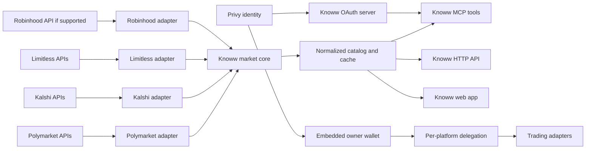

# Single API layer for multi-platform prediction markets

Status: Proposed

Date: 2026-09-01

## Decision summary

Knoww will expose one MCP server and one normalized market contract across
multiple prediction-market platforms. Polymarket, Kalshi, Limitless, Robinhood,
and future platforms will connect through adapters instead of defining separate
public APIs.

The main decisions are:

- Keep one MCP resource at `https://mcp.knoww.app/mcp`.
- Keep public tool names platform-neutral. A caller uses `search_markets` or
  `get_market`, not `search_polymarket` or `search_kalshi`.
- Put platform clients, validation, mapping, and special behavior in dedicated
  platform directories.
- Put the normalized market model and aggregation logic below the MCP layer so
  the web app, HTTP API, and MCP server use the same implementation.
- Use Privy social login as the Knoww identity flow for the web app and MCP.
- Continue using Reown on the web app for MetaMask, Coinbase Wallet, and other
  injected wallets. Disable Reown social login.
- Keep Knoww OAuth as the protocol-facing authorization server for MCP. Privy
  authenticates the person during that OAuth flow, but a Privy token is not an
  MCP access token.
- Treat market reads and trading as separate capabilities. A platform can
  support reads without supporting account creation or order execution.
- Use per-platform delegation for trading. Privy does not replace Kalshi,
  Polymarket, Limitless, or Robinhood authorization.

This document is the proposed target architecture. It does not approve a
production migration or trading launch by itself.

## Goals

- Let users and agents discover markets from all supported platforms through a
  single API.
- Provide stable identifiers and a consistent response format.
- Preserve platform-specific rules where normalization would lose meaning.
- Reuse the same market core in the web app and MCP server.
- Add platforms without adding large switch statements to MCP tools.
- Support read-only platforms and trading-capable platforms in the same
  registry.
- Give social-login users an embedded wallet and a controlled path to agentic
  trading.
- Keep venue credentials, wallet keys, and trading authority out of the MCP
  client and model context.

## Non-goals

- Pretending every platform has the same order, settlement, or account model.
- Merging markets solely because their titles look similar.
- Using a connected blockchain network as proof of jurisdiction or eligibility.
- Supporting Robinhood through scraped or reverse-engineered private APIs.
- Enabling unrestricted withdrawals, transfers, or trades through a broad
  session permission.
- Removing Reown from the existing external-wallet web flow.

## System architecture



The MCP Worker should not become the only place where aggregation exists. MCP
is one consumer of the market core. The web app and future products should use
the same normalized service.

## Platform support and constraints

| Platform | Public market data | Trading authorization | Initial status |
| --- | --- | --- | --- |
| Polymarket | Public Gamma, CLOB, and Data APIs | Wallet signatures, CLOB credentials, and eligible session-key delegation | Existing adapter to refactor |
| Kalshi | Public market, event, trade, and order-book endpoints | Kalshi account with RSA-PSS API request signing | Read adapter next |
| Limitless | Public REST and WebSocket market data | Privy identity plus scoped HMAC tokens; partner subaccounts and delegated signing are available to approved integrations | Read adapter after Kalshi; assess partner API for trading |
| Robinhood | Prediction markets are available in Robinhood products, but no supported public prediction-market API has been verified | Unknown until Robinhood publishes or grants supported access | Disabled and marked unavailable |

Polymarket documents public market data across its Gamma, CLOB, and Data APIs.
Kalshi documents unauthenticated market data separately from its RSA-signed
account requests. Limitless documents public market data and a partner API that
can derive scoped HMAC credentials from a Privy identity token. In Robinhood's
Q1 2026 earnings discussion, the company described broader API access as future
work and called reverse-engineered integrations unsupported. Knoww should not
promise Robinhood support until it has a documented or contracted API.

## Public MCP and HTTP contract

### Platform-neutral tools

The initial common tools should be:

- `list_platforms`
- `search_markets`
- `get_market`
- `get_event`
- `get_orderbook`
- `get_price_history`
- `get_market_trades`
- `compare_markets`

Account tools should also avoid wallet-only naming because a Kalshi or
Robinhood account is not a blockchain wallet:

- `get_account_positions`
- `get_account_activity`
- `get_account_orders`
- `get_account_pnl`
- `get_account_portfolio_value`

Existing `get_wallet_*` tools can remain as Polymarket compatibility tools for
one deprecation window. New integrations should use account-neutral tools.

When a feature cannot be represented honestly across platforms, keep it as a
platform extension and prefix its name, for example
`polymarket_get_market_holders`. Do this only for genuinely platform-specific
concepts.

### Search request

```json
{
  "query": "Federal Reserve rate cut",
  "platforms": ["polymarket", "kalshi", "limitless"],
  "status": "active",
  "category": "economics",
  "closesBefore": "2026-12-31T23:59:59Z",
  "sortBy": "relevance",
  "limit": 20,
  "cursor": "opaque-cursor"
}
```

`platforms` is optional. Omitting it searches every enabled read adapter. A
`chain` filter may also be optional, but it must not replace `platforms`.
Kalshi and Robinhood are not chain-native venues.

### Canonical identifiers

Every market and event needs a Knoww identifier that includes its source:

```text
polymarket:0xbd31dc8a...
kalshi:KXFED-26SEP-C25
limitless:btc-above-100k-september-2026
robinhood:<source-id>
```

A tool should accept the canonical identifier returned by search:

```json
{
  "marketId": "kalshi:KXFED-26SEP-C25"
}
```

The response should also include `sourceMarketId` and `sourceEventId`. A bare
source ID is not safe because two platforms can use the same slug or number.

The current Polymarket `slug`, `conditionId`, and `tokenId` inputs should remain
available during migration. They should be documented as Polymarket-only and
deprecated after clients can use canonical IDs.

### Canonical market model

The common model should contain fields that retain the same meaning across
platforms:

```ts
interface CanonicalMarket {
  schemaVersion: "1";
  id: string;
  platform: "polymarket" | "kalshi" | "limitless" | "robinhood";
  sourceMarketId: string;
  sourceEventId?: string;
  canonicalEventId?: string;
  title: string;
  description?: string;
  status: "unopened" | "active" | "paused" | "closed" | "resolved" | "unknown";
  outcomes: CanonicalOutcome[];
  openTime?: string;
  closeTime?: string;
  resolvedTime?: string;
  volume?: DecimalAmount;
  liquidity?: DecimalAmount;
  openInterest?: DecimalAmount;
  collateral?: AssetReference;
  chain?: ChainReference;
  resolutionRules?: string;
  resolutionSource?: string;
  sourceUrl?: string;
  capabilities: MarketCapabilities;
  platformDetails?: PlatformMarketDetails;
  fetchedAt: string;
}
```

All money, quantities, probabilities, and prices must remain decimal strings.
Knoww must use Decimal.js for calculations. The model must preserve the source
unit when a platform does not define a comparable currency.

`platformDetails` should be a discriminated union. It can retain fields such as
Polymarket condition IDs, Kalshi tickers, or Limitless venue contracts without
adding them to every market.

### Capabilities

Every adapter and market should declare what it supports:

```ts
interface MarketCapabilities {
  marketData: boolean;
  orderbook: boolean;
  priceHistory: boolean;
  publicTrades: boolean;
  accountPositions: boolean;
  createOrder: boolean;
  cancelOrder: boolean;
  redeem: boolean;
  withdrawals: boolean;
}
```

`list_platforms` should return adapter health, enabled environments, data
freshness, and capabilities. An agent can then avoid calling a tool that the
selected platform cannot support.

## Market matching across platforms

Two markets are not equivalent merely because they ask a similar question.
They may use different resolution sources, cutoff times, time zones, eligibility
rules, or settlement wording.

Knoww should keep every venue contract as a separate market and optionally
group comparable markets under a `canonicalEventId`. Automated matching should
store a confidence score and the factors used for the match. Low-confidence or
high-value matches need review.

The comparison layer must show venue-specific rules before presenting price
differences. It must never imply that a cross-venue trade is risk-free solely
because titles match.

## Adapter contracts

Read and trading adapters should be separate. This lets Knoww add public Kalshi
data without pretending that Privy can place Kalshi orders.

```ts
interface MarketDataAdapter {
  readonly platform: PlatformId;
  capabilities(): Promise<PlatformCapabilities>;
  searchMarkets(input: ProviderSearchInput): Promise<ProviderMarketPage>;
  getMarket(sourceMarketId: string): Promise<ProviderMarket>;
  getEvent(sourceEventId: string): Promise<ProviderEvent>;
  getOrderbook(sourceMarketId: string): Promise<ProviderOrderbook>;
  getPriceHistory(input: ProviderPriceHistoryInput): Promise<ProviderPriceHistory>;
}

interface TradingAdapter {
  readonly platform: PlatformId;
  connectionStatus(principalId: string): Promise<PlatformConnectionStatus>;
  previewOrder(input: CanonicalOrderIntent): Promise<OrderDraft>;
  placeOrder(input: PlaceDraftInput): Promise<OrderResult>;
  cancelOrder(input: CancelOrderInput): Promise<OrderResult>;
  redeem(input: RedeemInput): Promise<RedeemResult>;
}
```

The registry, not request input, owns provider base URLs. A user-controlled URL
must never reach a server-side fetch.

## Proposed repository structure

```text
apps/mcp/src/
  auth/
    oauth/
    privy/
    scopes.ts
    principal.ts
  core/
    errors/
    pagination/
    policy/
  platforms/
    polymarket/
      index.ts
      tools.ts
    kalshi/
      index.ts
      tools.ts
    limitless/
      index.ts
      tools.ts
    robinhood/
      index.ts
  tools/
    list-platforms.ts
    search-markets.ts
    get-market.ts
    get-event.ts
    get-orderbook.ts
    get-price-history.ts
    get-account-positions.ts
    preview-order.ts
    place-order.ts
  platform-registry.ts

packages/knoww-services/src/markets/
  core/
    types.ts
    errors.ts
    adapter.ts
    mapper.ts
    aggregator.ts
    pagination.ts
  platforms/
    polymarket/
      client.ts
      schemas.ts
      mapper.ts
      market-data.ts
      trading.ts
    kalshi/
      client.ts
      schemas.ts
      mapper.ts
      market-data.ts
      trading.ts
    limitless/
      client.ts
      schemas.ts
      mapper.ts
      market-data.ts
      trading.ts
    robinhood/
      client.ts
      schemas.ts
      mapper.ts
```

Platform HTTP clients, response schemas, and normalization belong in
`@knoww/services`. The folders under `apps/mcp/src/platforms` should contain
MCP-specific registration and any platform-only tools.

The common MCP tools must not import Gamma, CLOB, Kalshi, or Limitless response
types. They should depend only on canonical types and adapter interfaces.

## Aggregation, search, and pagination

### Live fan-out

For the first two platforms, `search_markets` can query enabled adapters in
parallel and merge the results. This has no database requirement, but it has
limits:

- response time follows the slowest provider;
- global sorting is approximate;
- provider cursors must be packed into one opaque composite cursor;
- rate limits differ by provider; and
- stable cross-platform deduplication is difficult.

### Indexed catalog

A production cross-platform search should ingest normalized markets into a
Knoww catalog. The catalog makes global relevance ranking, category mapping,
deduplication, filtering, and stable pagination possible. Live price and
order-book requests can still call the provider directly.

The index must record source timestamps and `fetchedAt`. Search responses should
state when data is stale.

### Partial failures

One provider outage should not fail a global search:

```json
{
  "markets": [],
  "partial": true,
  "platformErrors": [
    {
      "platform": "kalshi",
      "code": "UPSTREAM_UNAVAILABLE"
    }
  ],
  "nextCursor": "opaque-composite-cursor"
}
```

Each adapter needs its own timeout, retry policy, cache, circuit breaker, and
rate-limit budget.

## Privy implementation

### Identity boundaries

There are three separate identities or authorities:

| Layer | Purpose | Credential accepted |
| --- | --- | --- |
| Privy | Authenticate a Knoww user and expose verified linked accounts | Privy access or identity token, verified by Knoww |
| Knoww OAuth | Authorize an MCP client to call Knoww tools | Knoww access token bound to the MCP resource |
| Platform authorization | Act on a Polymarket, Kalshi, Limitless, or future account | Platform-specific delegation or account credentials |

Knoww must never accept a Privy access token as the MCP bearer token. MCP access
tokens must be issued for the canonical MCP resource and validated for that
audience. Knoww must also avoid forwarding MCP tokens to Privy or a market
platform.

### Shared Privy application

The web app and MCP authorization page should use the same Privy application
and authentication configuration. The Privy DID in the verified `sub` claim is
the stable Knoww principal. Email is display and recovery information, not the
database key.

The backend must verify the token signature, issuer, audience, and expiration.
If identity tokens are enabled, Knoww can use the verified linked-account data
to locate the user's embedded wallet. Tokens must not appear in URLs, logs,
analytics, MCP arguments, or model context.

### Web login and wallet behavior

The web app should use two deliberately separate paths:

- Privy handles Google and other approved social login methods. Social users
  receive a Privy embedded EVM wallet.
- Reown handles MetaMask, Coinbase Wallet, and other injected wallets. Reown
  email and social login remain disabled.

This proposal does not link an external Reown wallet account to a Privy social
account. Under the selected social-only MCP policy, a wallet-only web user must
sign in through Privy before using MCP. Automatic account linking based on an
email address is forbidden.

For automatic embedded-wallet creation, use the current chain-specific Privy
configuration. The intended behavior is `users-without-wallets` for Ethereum so
a social user receives one wallet without creating an extra wallet for users
who already have one in the same Privy identity.

### MCP authorization flow

The user experiences one initial authorization journey:

1. The MCP client requests `https://mcp.knoww.app/mcp`.
2. The MCP server returns the OAuth protected-resource challenge.
3. The client starts authorization with Knoww and sends PKCE, state, redirect
   URI, requested scope, and the MCP `resource` value.
4. The Knoww authorization page opens Privy social login.
5. Knoww verifies the Privy token and resolves the Privy DID.
6. The page shows the MCP client's name and requested Knoww scopes.
7. The user approves the request.
8. Knoww issues an authorization code and redirects to the exact registered
   client redirect URI.
9. The client exchanges the code using PKCE.
10. Knoww issues its own MCP access and refresh tokens, bound to the MCP
    resource and client.

Privy supplies the login session inside the flow. Knoww OAuth remains because
MCP clients require OAuth discovery, client registration or metadata, PKCE,
resource indicators, access-token issuance, refresh, revocation, and scope
handling.

### Number of user approvals

| Action | User interaction |
| --- | --- |
| First MCP connection | One Privy login and Knoww consent journey |
| Read public markets | No additional approval while the MCP grant remains valid |
| First trade on a platform | One platform connection and delegation setup |
| Routine order inside an approved policy | No per-order wallet prompt unless the user's policy requires it |
| Policy change, new platform, or broader scope | Step-up consent |
| Withdrawal, transfer, or other sensitive action | Interactive owner approval |

The user should not see two separate login pages for Privy and Knoww. The Knoww
authorization page hosts the Privy login and consent experience.

### Social user moving from web to MCP

For a user who first joined through the web app:

1. Privy creates the user and embedded owner wallet during web onboarding.
2. The web backend stores the Knoww principal keyed by Privy DID.
3. The user connects Knoww MCP from an agent or MCP client.
4. Privy recognizes the existing social account during the Knoww authorization
   flow.
5. Knoww resolves the same Privy DID and embedded wallet.
6. The MCP client receives a Knoww token with `markets:read`.
7. The user can call read-only tools immediately.
8. On the first trading request, Knoww opens a trusted setup page for the
   selected platform.
9. The user approves the platform-specific account or session delegation.
10. Future operations remain within that platform's policy and Knoww scopes.

### Privy wallets and MCP session keys

The user's embedded Privy wallet is the owner wallet. It should not become an
unrestricted backend signer for an agent.

For Polymarket automation, the proposed model is a separate Privy server wallet
for each Knoww principal, MCP client, and Polymarket account. The owner wallet
authorizes that server-wallet address as a CLOB-only Polymarket Session Key.
Knoww stores the public binding and lets Privy protect the signing key.

Two policy layers should apply:

1. Privy wallet policy restricts typed-data signing to the intended chain,
   verifying contracts, message types, and allowed operations.
2. Knoww trading policy restricts markets, maximum order size, cumulative
   exposure, price and slippage bounds, time windows, and daily loss.

A Polymarket compatibility test must prove Deposit Wallet ownership, EIP-712
signing, correct exchange contracts, CLOB credentials, session-key visibility,
revocation, and expiry before production use.

Session authority does not automatically cover redemption, approvals,
transfers, bridging, or withdrawals. These operations require a separate
platform capability and an interactive owner approval unless the team approves
a narrower audited delegation later.

### Platform-specific trading authorization

Privy is not a universal exchange credential.

#### Polymarket

- Privy embedded wallet acts as the user-controlled owner wallet.
- A separate Privy server wallet may act as the authorized CLOB Session Key.
- Knoww uses `preview_order` followed by `place_order` with an immutable draft.
- Cancellation is limited to orders created by the applicable delegation.
- Redemption and funds movement remain interactive owner actions initially.

#### Kalshi

- The user needs an eligible Kalshi account.
- Kalshi API requests use an API key ID and RSA-PSS signatures.
- Knoww needs a trusted account-connection flow and protected credential store.
- Privy login identifies the Knoww user but does not authorize Kalshi orders.

#### Limitless

- Limitless documents Privy identity tokens for deriving scoped API tokens.
- Approved partners can use HMAC credentials, create subaccounts, and use
  delegated signing.
- Knoww should request only the scopes needed for the selected operations.
- HMAC secrets remain on the backend and never enter the browser or MCP client.

#### Robinhood

- Keep the adapter disabled until Robinhood provides supported API access.
- Do not use browser session cookies, scraping, or undocumented endpoints.
- Reassess account, trading, and compliance requirements when an official API
  becomes available.

### MCP scopes

Use action scopes that remain stable as platforms are added:

- `markets:read`
- `accounts:read`
- `orders:read`
- `orders:create`
- `orders:cancel`
- `positions:redeem`
- `funds:deposit`
- `funds:withdraw`

The OAuth scope permits the action class. A separate platform delegation record
specifies which platform, account, MCP client, wallet, and policy may perform
it. Adding a new platform always requires explicit delegation even if the MCP
client already has `orders:create`.

When a tool lacks a scope, return `403 Forbidden` with
`error="insufficient_scope"` and the minimum required scope. A scope does not
replace account ownership, platform eligibility, policy checks, or confirmation.

## Order execution contract

Mutating tools should use an immutable two-step flow:

```text
preview_order -> place_order
```

`preview_order` resolves:

- canonical and source market identifiers;
- platform and account;
- exact outcome and source outcome identifier;
- side, quantity, price, order type, and expiration;
- current order book, fees, and expected slippage;
- collateral, available balance, and maximum exposure;
- eligibility and platform capability; and
- a canonical draft hash with a short expiration.

`place_order` accepts only `draftId` and `idempotencyKey`. It must not accept a
second free-form version of the trade. Immediately before signing, the server
reloads the market and rejects the draft if status, price bounds, outcome,
minimum size, tick size, fees, eligibility, or policy has changed.

Every monetary calculation uses Decimal.js. Every mutation uses a unique
idempotency key and an append-only audit record.

## Data and credential storage

Live public reads can start without a new database. Reliable global search and
all mutating operations need durable storage.

Recommended records include:

- Knoww principal keyed by Privy DID;
- verified social and embedded-wallet references;
- MCP client registration and consent;
- OAuth grants, refresh-token families, and revocation state;
- platform account connections;
- platform delegation scope, status, expiry, and revocation;
- Privy wallet IDs and public addresses, not private keys;
- protected references to Kalshi or Limitless credentials;
- order drafts and canonical hashes;
- idempotency keys and operation state;
- upstream order IDs and transaction hashes;
- trading policies and counters; and
- append-only security and trading audit events.

A relational or transactional database should enforce uniqueness and operation
state. Privy, a KMS, or a dedicated signing service should hold signing keys.
Platform secrets must not be stored in Workers KV, browser storage, source code,
logs, analytics, MCP arguments, or model context.

Privy does not make balances interchangeable across chains. Polygon, Base, and
future Solana assets remain separate. Funding across chains needs explicit
bridge or routing flows, fee previews, supported-asset checks, and user consent.

## Security requirements

### Trust boundaries

Treat these inputs as untrusted:

- MCP client identity and redirect metadata;
- model-generated tool arguments;
- market titles, descriptions, rules, and resolution sources;
- every platform API response;
- platform callbacks and webhooks; and
- wallet and account identifiers supplied by users.

The model never authorizes a financial action. Authorization checks run in code
after schema validation.

### Required controls

- Validate MCP and HTTP inputs with strict schemas and size limits.
- Validate every upstream response before normalization.
- Use fixed allowlisted provider hosts and reject redirects to untrusted hosts.
- Require PKCE, exact redirect URI matching, state validation, and MCP resource
  audience binding.
- Bind consent and delegation to the Privy principal, MCP client, platform, and
  account.
- Use short-lived access tokens and rotate refresh tokens.
- Protect auth, search, and trading endpoints with separate rate limits.
- Do not expose internal errors or stack traces.
- Use generic client errors and structured server logs with request IDs.
- Treat all quoted upstream content as data, not instructions.
- Require reauthentication for delegation changes, revocation, withdrawals, and
  other sensitive actions.
- Enforce geographic, regulatory, and platform eligibility at execution time.
- Record every mutation and authorization change in an append-only audit log.
- Provide an immediate way to revoke a client, platform connection, or session
  signer.

## Chain and platform filtering

Platform and chain are different concepts.

- Polygon may prioritize Polymarket.
- Base may prioritize Limitless.
- Kalshi and Robinhood should not disappear because an EVM or Solana wallet is
  connected.
- A connected chain can seed a removable UI filter. It must not become a hard
  routing or eligibility rule.
- Geographic eligibility comes from the platform and compliance checks, not a
  wallet network.

The default web experience may show all supported markets. A user's selected
platforms, region, account connections, and connected chain can then refine the
list explicitly.

## Reliability and observability

Each adapter needs:

- a documented timeout and retry policy;
- per-provider rate-limit accounting;
- a circuit breaker;
- cache and staleness rules;
- structured logs tagged with platform, operation, and request ID;
- latency, error-rate, partial-result, and freshness metrics; and
- a health result exposed through `list_platforms`.

Do not use `console.log`. Logs must not contain access tokens, HMAC secrets,
private keys, complete signed payloads, or user PII.

## Testing strategy

Every read adapter must pass the same contract suite:

- canonical ID construction;
- market and outcome normalization;
- status mapping;
- decimal precision;
- pagination and cursor handling;
- timeout and rate-limit translation;
- malformed upstream responses;
- partial provider failures; and
- prompt-like text in upstream fields.

Trading adapters also need:

- sandbox or demo execution where the platform provides it;
- signature and credential tests;
- draft expiry and revalidation;
- idempotent retry behavior;
- policy denial tests;
- partial-fill and cancellation tests;
- revocation tests; and
- proof that secrets never reach responses or logs.

New HTTP endpoints must include OpenAPI annotations, input validation, rate
limiting, bounded responses, and consistent error shapes.

## Migration plan

### Phase 0: freeze contracts

1. Define `PlatformId`, canonical market and event types, capability types, and
   common errors.
2. Define the adapter contracts and composite cursor format.
3. Add contract fixtures without changing production behavior.

### Phase 1: isolate Polymarket

1. Move Gamma, CLOB, Data API, and profile code into Polymarket directories.
2. Implement the read adapter around existing behavior.
3. Route current MCP tools through the registry.
4. Keep all current tool names and responses compatible.

### Phase 2: add multi-platform reads

1. Add `list_platforms`.
2. Add namespaced canonical IDs.
3. Add the Kalshi read adapter.
4. Add the Limitless read adapter.
5. Add partial-result handling and composite cursors.
6. Keep Robinhood disabled.

### Phase 3: add the indexed catalog

1. Ingest normalized markets and events.
2. Add source freshness and change tracking.
3. Add canonical-event grouping and review tools.
4. Move web and MCP search to the common catalog.

### Phase 4: replace Google-specific identity with Privy

1. Configure one Privy application for the web and MCP authorization page.
2. Add Privy social login and embedded Ethereum wallet creation to the web app.
3. Disable Reown social and email login while retaining injected wallets.
4. Replace Google-specific MCP principal fields with provider-neutral fields
   keyed by Privy DID.
5. Verify Privy tokens on the backend and issue separate Knoww OAuth tokens.
6. Migrate or expire existing Google-only grants deliberately. Do not silently
   merge users by email.

### Phase 5: add delegated trading

1. Implement platform connection and revocation pages.
2. Add database records for delegation, policy, drafts, idempotency, and audit.
3. Validate the Privy server-wallet and Polymarket Session Key path.
4. Ship `preview_order` before `place_order`.
5. Start with small limits and mandatory confirmation.
6. Add policy-based unattended orders only after audit and monitoring.
7. Evaluate Limitless partner subaccounts and Kalshi credential connections
   separately.

## Decisions still required

- Whether the normalized catalog uses D1, Postgres, or a separate search store.
- Whether the HTTP market API is internal first or public from the first
  release.
- The exact canonical event matching process and review threshold.
- Platform-specific data redistribution and attribution rights.
- Which Privy social providers are enabled at launch.
- Whether embedded wallets are created for all Privy users or only users without
  a wallet in the same Privy identity.
- How legacy Google MCP principals and grants expire or migrate.
- Maximum trading limits, loss limits, and confirmation rules.
- Whether Knoww receives approved Polymarket Session Key and Limitless partner
  access.
- Whether Robinhood offers Knoww a supported market-data or trading API.

## Related repository documents

- `docs/decisions/2026-08-31-mcp-google-oidc.md`
- `docs/decisions/2026-08-31-mcp-trading-authorization.md`
- `docs/ARCHITECTURE.md`
- `docs/API.md`

If this proposal is accepted, it supersedes Google as the selected MCP login
provider in the first two decision records. Their OAuth security requirements
and Polymarket authorization analysis remain useful until replacement ADRs are
accepted.

## Official references

- [MCP authorization](https://modelcontextprotocol.io/specification/2025-11-25/basic/authorization)
- [MCP URL-mode elicitation](https://modelcontextprotocol.io/specification/2025-11-25/client/elicitation)
- [Privy access tokens](https://docs.privy.io/authentication/user-authentication/access-tokens)
- [Privy identity tokens](https://docs.privy.io/user-management/users/identity-tokens)
- [Privy automatic wallet creation](https://docs.privy.io/basics/react/advanced/automatic-wallet-creation)
- [Privy server-side wallet access](https://docs.privy.io/wallets/wallets/server-side-access)
- [Privy wallet policies](https://docs.privy.io/controls/policies/overview)
- [Polymarket market data](https://docs.polymarket.com/market-data/overview)
- [Polymarket wallets and authentication](https://docs.polymarket.com/trading/wallets-auth)
- [Polymarket Session Keys](https://docs.polymarket.com/trading/session-keys)
- [Kalshi public market data](https://docs.kalshi.com/getting_started/quick_start_market_data)
- [Kalshi authenticated requests](https://docs.kalshi.com/getting_started/quick_start_authenticated_requests)
- [Limitless programmatic API](https://docs.limitless.exchange/developers/programmatic-api)
- [Robinhood Q1 2026 earnings transcript](https://investors.robinhood.com/static-files/c2119020-41a1-4008-b9ae-db1b9fd6fb5e)
